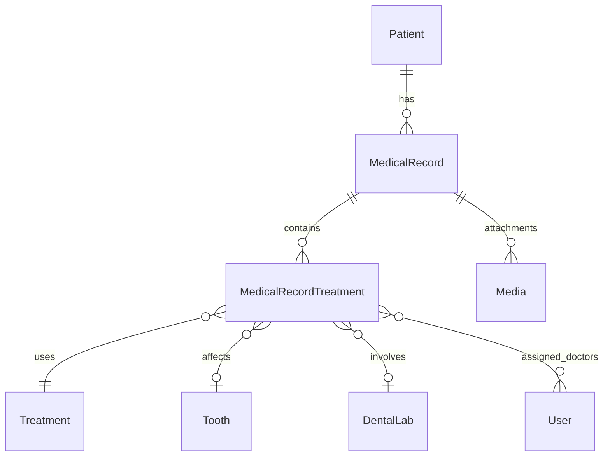

# Medical Record Feature Plan

## Data Model Overview



## 1. Enums

Create in [`app/Enums/`](app/Enums/):

- **RecordTypeEnum** - `InClinic`, `External`
- **FillerMaterialEnum** - `TemporaryFillingIRM`, `CompositeResin`, `AmalgamFilling`, `GlassIonomerFilling`, `CeramicFilling`, `GoldFilling`
- **ToothPositionEnum** - All 32 adult teeth positions (FDI notation: 11-18, 21-28, 31-38, 41-48) + 20 primary teeth (51-55, 61-65, 71-75, 81-85)

## 2. Database Migrations

### 2.1 `create_dental_labs_table.php`

- `uuid id`, `tenant_id`, `name`, `phone`, `address`, `timestamps`

### 2.2 `create_treatments_table.php`

- `uuid id`, `tenant_id`, `name`, `description`, `default_cost`, `timestamps`

### 2.3 `create_medical_records_table.php`

- `uuid id`, `tenant_id`, `patient_id` (FK), `record_date`, `record_type` (enum), `case_name`, `description`, `total_cost`, `remaining_amount`, `timestamps`

### 2.4 `create_medical_record_treatments_table.php`

- `uuid id`, `medical_record_id` (FK), `treatment_id` (FK nullable), `treatment_date`, `treatment_cost`, `treatment_description`, `tooth_position` (enum nullable), `filler_material` (enum nullable), `dental_lab_id` (FK nullable), `session_number`, `timestamps`

### 2.5 `create_doctor_medical_record_treatment_table.php` (pivot)

- `medical_record_treatment_id`, `user_id` (doctor), `timestamps`

## 3. Models

Create in [`app/Models/`](app/Models/):

| Model | Key Relationships |

|-------|-------------------|

| **DentalLab** | `hasMany` MedicalRecordTreatment |

| **Treatment** | `hasMany` MedicalRecordTreatment |

| **MedicalRecord** | `belongsTo` Patient, `hasMany` MedicalRecordTreatment, `morphMany` Media |

| **MedicalRecordTreatment** | `belongsTo` MedicalRecord, Treatment, DentalLab; `belongsToMany` User (doctors) |

All models use: `HasUuids`, `BelongsToTenant`, `HasFactory`, respective `FilterQuery` trait.

## 4. Data DTOs

Create in [`app/Data/`](app/Data/):

- `DentalLabData.php`
- `TreatmentData.php`
- `MedicalRecordData.php`
- `MedicalRecordTreatmentData.php`

## 5. Form Requests

Create request classes per domain in [`app/Http/Requests/`](app/Http/Requests/):

- `DentalLabRequests/` - Store, Update, Filter
- `TreatmentRequests/` - Store, Update, Filter
- `MedicalRecordRequests/` - Store, Update, Filter
- `MedicalRecordTreatmentRequests/` - Store, Update, Filter

## 6. API Resources

Create in [`app/Http/Resources/`](app/Http/Resources/):

- `DentalLabResource.php`
- `TreatmentResource.php`
- `MedicalRecordResource.php`
- `MedicalRecordTreatmentResource.php`
- `ToothOverviewResource.php` - Aggregates patient teeth data with treatment history

## 7. Services

Create in [`app/Services/`](app/Services/):

- `DentalLabService.php`
- `TreatmentService.php`
- `MedicalRecordService.php` - Handles case creation with attachments
- `MedicalRecordTreatmentService.php` - Handles treatment with doctor assignments

## 8. Policies

Create in [`app/Policies/`](app/Policies/):

- `DentalLabPolicy.php`
- `TreatmentPolicy.php`
- `MedicalRecordPolicy.php`
- `MedicalRecordTreatmentPolicy.php`

## 9. Filter Query Traits

Create in [`app/Traits/FilterQueries/`](app/Traits/FilterQueries/):

- `DentalLabFilterQuery.php`
- `TreatmentFilterQuery.php`
- `MedicalRecordFilterQuery.php` - Filter by patient, date range, type, tooth
- `MedicalRecordTreatmentFilterQuery.php`

## 10. API Routes

Add to [`routes/api.php`](routes/api.php):

```php
Route::apiResource('dental-labs', DentalLabController::class);
Route::apiResource('treatments', TreatmentController::class);
Route::apiResource('medical-records', MedicalRecordController::class);
Route::apiResource('medical-records.treatments', MedicalRecordTreatmentController::class);

// Special endpoints
Route::get('patients/{patient}/tooth-overview', [PatientController::class, 'toothOverview']);
Route::get('patients/{patient}/medical-records', [PatientController::class, 'medicalRecords']);
```

## 11. Tooth Age Detection Logic

In `MedicalRecordResource` or a helper:

```php
public function getToothType(Patient $patient): string
{
    $age = $patient->birthday?->age ?? 18;
    return $age < 12 ? 'primary' : 'permanent';
}
```

Primary teeth (deciduous): Positions 51-55, 61-65, 71-75, 81-85 (20 teeth)

Permanent teeth (adult): Positions 11-18, 21-28, 31-38, 41-48 (32 teeth)

## 12. Permission Seeders

Create in [`database/seeders/Permissions/`](database/seeders/Permissions/):

- `DentalLabPermissionsSeeder.php`
- `TreatmentPermissionsSeeder.php`
- `MedicalRecordPermissionsSeeder.php`
- `MedicalRecordTreatmentPermissionsSeeder.php`

Update [`RolesAndPermissionsSeeder.php`](database/seeders/RolesAndPermissionsSeeder.php) to include new seeders.

## 13. Factories

Create in [`database/factories/`](database/factories/):

- `DentalLabFactory.php`
- `TreatmentFactory.php`
- `MedicalRecordFactory.php`
- `MedicalRecordTreatmentFactory.php`

## 14. Feature Tests

Create test directories in [`tests/Feature/`](tests/Feature/):

- `DentalLab/` - Endpoints, Validation, Authorization, Filters, Pagination, EdgeCases
- `Treatment/` - Same structure
- `MedicalRecord/` - Same structure + tooth overview tests
- `MedicalRecordTreatment/` - Same structure

## File Creation Order

Phase 1 - Foundation:

1. Enums (RecordTypeEnum, FillerMaterialEnum, ToothPositionEnum)
2. Migrations (all 5)
3. Models with relationships

Phase 2 - Supporting Entities:

4. DentalLab full CRUD (Data, Requests, Resource, Service, Policy, Controller, FilterQuery, Permissions, Factory, Tests)
5. Treatment full CRUD (same pattern)

Phase 3 - Core Feature:

6. MedicalRecord full CRUD
7. MedicalRecordTreatment full CRUD
8. Tooth overview endpoint
9. Patient relationship updates

Phase 4 - Finalization:

10. Run all migrations
11. Update RolesAndPermissionsSeeder
12. Run Pint formatter
13. Run full test suite
