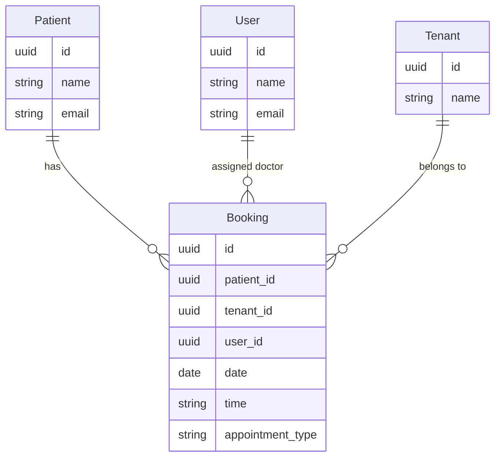

# Booking (Appointments) API Contract (Flutter)

This document is the API contract for the **Booking (Calendar / Appointments)** feature in Hakeem. It is intended for Flutter developers integrating against the Hakeem backend. It uses the Figma designs (Calendar view and Patient Appointments tab) as the source of truth for UI and data points. It includes examples and a deep dive into the feature. The API is **implemented** in the backend.

---

## 1. Overview and Authentication

### Base URL

All routes are prefixed with `/api`. Base URL: `https://hakeem.mustafafares.com/api`.

### Authentication

All Booking endpoints require authentication via **Laravel Sanctum**:

- **Header:** `Authorization: Bearer <token>`
- **Obtain token:** `POST /api/auth/login` with `username` and `password`. For full auth endpoints, see [Auth API contract](auth-api-contract.md).

Unauthenticated requests receive **401 Unauthorized**.

### Tenancy

The backend is multi-tenant. The authenticated user’s tenant context is applied automatically; you do **not** send a tenant ID in requests.

### Request and Response Format

- **Content-Type:** `application/json`
- **Request body and query parameters:** **camelCase** (e.g. `patientId`, `userId`, `date`, `time`, `appointmentType`)
- **Response body:** **camelCase** (Laravel API Resources return camelCase keys)

---

## 2. Entity Relationship Diagram



- **Patient** (1) → (N) **Booking**
- **User** (doctor) (1) → (N) **Booking** (assigned doctor via `userId`)
- **Tenant** (1) → (N) **Booking** (tenant context; applied automatically)

---

## 3. Enums (Source of Truth for Dropdowns)

### Appointment Type

Used for **“Booking Type”** in the calendar blocks and in the Patient Appointments tab filter.

| API Value  | Display Label (example) |
|------------|--------------------------|
| `preview`  | Preview                  |
| `surgery`  | Surgery                  |
| `review`   | Review                   |

---

## 4. Bookings Endpoints

### List Bookings

**`GET /api/bookings`**

Used for: **Calendar weekly/monthly view**, **Patient Appointments tab** (filter by `patientId`).

**Query parameters:**

| Parameter | Type | Description |
|-----------|------|-------------|
| `perPage` | integer | Page size (1–100). Default: 20 |
| `filter[patientId]` | UUID | Filter by patient (e.g. patient profile “Appointments” tab); use `null` for bookings with no patient |
| `filter[tenantId]` | UUID | Filter by tenant; use `null` for unassigned |
| `filter[userId]` | UUID | Filter by assigned doctor; use `null` for unassigned |
| `filter[date]` | date (Y-m-d) | Partial match on booking date |
| `filter[startDate]` | date (Y-m-d) | Booking date ≥ |
| `filter[endDate]` | date (Y-m-d) | Booking date ≤ |
| `filter[time]` | string | Partial match on time |
| `filter[appointmentType]` | string | `preview`, `surgery`, or `review` |
| `filter[createdAfter]` | date | Created at ≥ |
| `filter[createdBefore]` | date | Created at ≤ |
| `search` | string | Search (backend-defined) |
| `sort` | string | `date`, `-date`, `time`, `-time`, `appointmentType`, `-appointmentType`, `userId`, `-userId`, `patientId`, `-patientId`. Default: `-created_at` |

**Response:** Paginated collection with `data`, `links`, `meta`. Each item follows the Booking resource shape below. The **list** endpoint eager-loads `patient` and `user` (and their `primaryImage` when available), so calendar and patient-tab responses include nested patient and user objects. Use these for display without extra lookups.

**Calendar usage:** Request a date range with `filter[startDate]` and `filter[endDate]` (on booking date), or `filter[createdAfter]` / `filter[createdBefore]`. Optionally filter by `userId` and use `search` for the header search bar.

**Patient tab usage:** `GET /api/bookings?filter[patientId]={patientId}&sort=-date&perPage=20`.

---

### Create Booking

**`POST /api/bookings`**

Triggered by the **(+) “Add New Appointment”** button in the Calendar header.

**Request body:**

| Field | Type | Required | Validation |
|-------|------|----------|------------|
| `patientId` | UUID | No | Must exist in `patients` (nullable in backend) |
| `userId` | UUID | No | Must exist in `users` (assigned doctor; nullable in backend) |
| `date` | string | Yes | Date, format `Y-m-d` |
| `time` | string | Yes | Time (e.g. `09:00`) |
| `appointmentType` | string | Yes | `preview`, `surgery`, or `review` |

**Response:** `201 Created`. Body includes `data` (full booking resource) and `message`.

---

### Show Booking

**`GET /api/bookings/{id}`**

Used when the user clicks an appointment block (**“Preview”** or options) to view full details.

**Response:** `200 OK`. Single booking resource. The show endpoint does not eager-load `patient` or `user` by default; use the list endpoint when you need nested patient/user for calendar or profile views.

---

### Update Booking

**`PUT /api/bookings/{id}`** or **`PATCH /api/bookings/{id}`**

Used when editing from the **(...)** options menu on an appointment block.

**Request body:** Same fields as create, all optional: `patientId`, `userId`, `date`, `time`, `appointmentType`.

**Response:** `200 OK`. Full booking resource.

---

### Delete Booking

**`DELETE /api/bookings/{id}`**

Used from the **(...)** options menu on an appointment block.

**Response:** `200 OK`. Deleted resource in `data` and `message`.

---

### Booking Resource Shape (camelCase)

| Field | Type | Description |
|-------|------|-------------|
| `id` | string (UUID) | Primary key |
| `patient` | object \| null | Patient resource when loaded (in list response) |
| `user` | object \| null | User (doctor) resource when loaded (in list response) |
| `patientId` | string (UUID) | Patient reference |
| `tenantId` | string (UUID) | Tenant reference |
| `userId` | string (UUID) | Assigned doctor (user) reference |
| `date` | string | Date only, `YYYY-MM-DD` |
| `time` | string | Time (e.g. `09:00`) |
| `appointmentType` | string | `preview`, `surgery`, or `review` |
| `createdAt` | string | ISO date-time |
| `updatedAt` | string | ISO date-time |

**Note:** The **list** endpoint (`GET /api/bookings`) returns each item with nested `patient` and `user` (and their `primaryImage` when loaded). The **show** endpoint does not eager-load them; use list when you need names and details for calendar or patient-appointments views.

---

## 5. Related Endpoints (Figma Dropdowns and Context)

| Purpose | Method | Endpoint | Use in UI |
|---------|--------|----------|-----------|
| Patient list (select patient) | GET | `/api/patients` | “Add Booking” form – patient dropdown |
| Doctor list (select doctor) | GET | `/api/users` | “Add Booking” form – doctor dropdown |
| Single patient | GET | `/api/patients/{id}` | Resolve patient name for booking block |
| Single user (doctor) | GET | `/api/users/{id}` | Resolve doctor name for booking block |

Patient and User resources are defined in [Patient Management API contract](patient-management-api-contract.md) and [User Management API contract](user-management-api-contract.md). Use their `id`, `name`, and `email` for dropdowns and booking block display.

---

## 6. Deep Dive: Mapping Figma to API

### Screen: Calendar (Weekly / Monthly View)

| Figma element | API / action |
|---------------|--------------|
| Week range (e.g. “Oct 23 - Oct 29 2024”) | Request `GET /api/bookings` with `filter[createdAfter]=2024-10-23` and `filter[createdBefore]=2024-10-29` (or filter by `date` as needed) |
| “Search Appointment, Patient, etc…” | Pass value as `search` query parameter on list endpoint |
| “Filter” button | Apply optional `filter[userId]`, `filter[appointmentType]` (and date range) |
| “Monthly” / “Weekly” toggle | Same list endpoint; adjust date range |
| (+) Add New Appointment | `POST /api/bookings` with patientId, userId, date, time, appointmentType |
| Appointment block (patient name, type, doctor, time) | Each block = one booking from list response; resolve patient/user names via their IDs |
| (...) options on block | “Preview” → `GET /api/bookings/{id}`; Edit → `PUT /api/bookings/{id}`; Delete → `DELETE /api/bookings/{id}` |
| Print icon | Client-side print of current calendar data (no extra API) |

### Screen: Patient List – Patient Profile – “Appointments” Tab

| Figma element | API / action |
|---------------|--------------|
| “Past” / “Upcoming” | Two calls: past = `filter[patientId]={id}` + `filter[date]` before today; upcoming = `filter[patientId]={id}` + `filter[date]` from today; or derive from list |
| Timeline entries (date, time, booking type) | `GET /api/bookings?filter[patientId]={patientId}&sort=-date`; display `date`, `time`, `appointmentType` |
| “Sorted by: Last Appointment” | Use `sort=-date` (or `-createdAt`) |
| “Booking Type: None” | When user selects a type, add `filter[appointmentType]=preview` (or selected value) |

---

## 7. Request/Response Examples

### Example: List Bookings for Patient (Appointments Tab)

**Request**

```http
GET /api/bookings?filter[patientId]=9d4e2c1a-1234-5678-abcd-000000000001&sort=-date&perPage=20
Authorization: Bearer <token>
```

**Response (200 OK)** — Paginated list; `data` is an array of booking resources. Resolve `patientId` and `userId` with patients/users endpoints for names.

### Example: Create Booking

**Request**

```http
POST /api/bookings
Content-Type: application/json
Authorization: Bearer <token>
```

```json
{
  "patientId": "9d4e2c1a-1234-5678-abcd-000000000001",
  "userId": "9d4e2c1a-7777-2222-cccc-444444444444",
  "date": "2024-10-23",
  "time": "09:00",
  "appointmentType": "preview"
}
```

**Response (201 Created)**

```json
{
  "data": {
    "id": "9d4e2c1a-aaaa-1111-bbbb-555555555555",
    "patientId": "9d4e2c1a-1234-5678-abcd-000000000001",
    "tenantId": "9d4e2c1a-tenant-0000-0000-000000000001",
    "userId": "9d4e2c1a-7777-2222-cccc-444444444444",
    "date": "2024-10-23",
    "time": "09:00",
    "appointmentType": "preview",
    "createdAt": "2024-10-20T10:00:00.000000Z",
    "updatedAt": "2024-10-20T10:00:00.000000Z"
  },
  "message": "Created successfully"
}
```

### Example: Update Booking

**Request**

```http
PATCH /api/bookings/9d4e2c1a-aaaa-1111-bbbb-555555555555
Content-Type: application/json
Authorization: Bearer <token>
```

```json
{
  "time": "10:00",
  "appointmentType": "surgery"
}
```

**Response (200 OK)** — Full booking resource.

---

## 8. Error Handling and Validation

| Status | Meaning | Typical cause |
|--------|---------|----------------|
| **401 Unauthorized** | Unauthenticated | Missing or invalid Bearer token |
| **403 Forbidden** | Not allowed | User lacks permission (policy) |
| **404 Not Found** | Resource missing | Invalid UUID or deleted booking |
| **422 Unprocessable Entity** | Validation failed | Invalid or missing fields (e.g. `date`, `time`, `appointmentType`) |

**422 response body** example:

```json
{
  "message": "The given data was invalid.",
  "errors": {
    "patientId": ["The selected patient id is invalid."],
    "date": ["The date field is required."],
    "time": ["The time field is required."],
    "appointmentType": ["The selected appointment type is invalid."]
  }
}
```

**Validation rules (quick reference):**

- **Booking:** `patientId` (optional, UUID, exists), `userId` (optional, UUID, exists), `date` (required, Y-m-d), `time` (required, string), `appointmentType` (required, enum: `preview`, `surgery`, `review`).

---

## 9. Flutter-Oriented Notes

- **JSON keys:** Use **camelCase** for all request and response keys.
- **Dates:** Use **YYYY-MM-DD** for `date`; use string for `time` (e.g. `09:00`).
- **IDs:** All resource IDs are **UUID** strings.
- **Pagination:** Use `meta.current_page`, `meta.last_page`, `links.next` / `links.prev`; control page size with `perPage`.
- **Calendar:** For weekly view, compute the date range and request bookings with `filter[createdAfter]` and `filter[createdBefore]` (or filter by `date` as supported). Map response items to grid by `date` + `time`.
- **Patient “Past” / “Upcoming” counts:** Derive from list: past = `filter[patientId]` + `filter[createdBefore]=today` (or date filter); upcoming = `filter[patientId]` + `filter[createdAfter]=today` (or use `filter[date]` as needed).

---

## 10. Implementation Status

The Bookings API is **implemented** in the backend. Base path: `/api/bookings`. Use the resource shape and filters above for integration.
