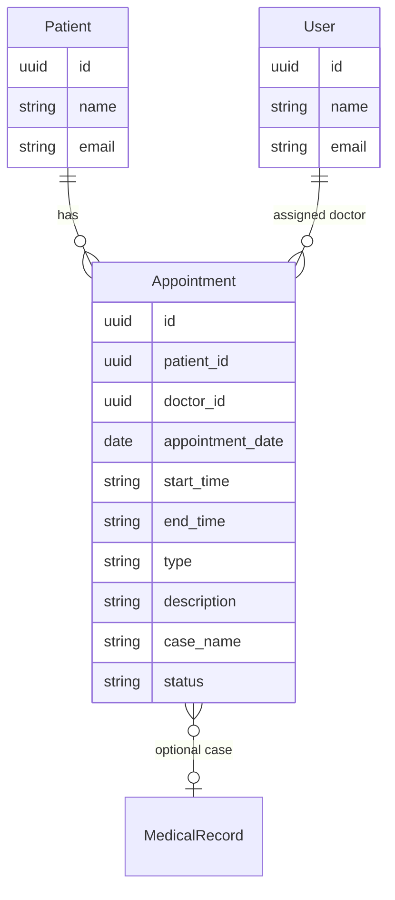

# Booking (Appointments) API Contract (Flutter)

This document is the API contract for the **Booking (Calendar / Appointments)** feature in Hakeem. It is intended for Flutter developers integrating against the Hakeem backend. It uses the Figma designs (Calendar view and Patient Appointments tab) as the source of truth for UI and data points. **The appointments API is not yet implemented in the backend;** this contract describes the intended API for implementation and frontend integration.

---

## 1. Overview and Authentication

### Base URL

All routes are prefixed with `/api`. Base URL: `https://hakeem.mustafafares.com/api`.

### Authentication

All Booking endpoints require authentication via **Laravel Sanctum**:

- **Header:** `Authorization: Bearer <token>`
- **Obtain token:** `POST /api/auth/login` with `username` and `password` (or `email` and `password`, depending on backend configuration).

Unauthenticated requests receive **401 Unauthorized**.

### Tenancy

The backend is multi-tenant. The authenticated user’s tenant context is applied automatically; you do **not** send a tenant ID in requests.

### Request and Response Format

- **Content-Type:** `application/json`
- **Request body and query parameters:** **camelCase** (e.g. `patientId`, `doctorId`, `appointmentDate`, `startTime`, `endTime`)
- **Response body:** **camelCase** (Laravel API Resources return camelCase keys)

---

## 2. Entity Relationship Diagram



- **Patient** (1) → (N) **Appointment**
- **User** (doctor) (1) → (N) **Appointment** (assigned doctor)
- **Appointment** may optionally reference a **MedicalRecord** (case) via `caseName` or `medicalRecordId`; exact linkage is backend-defined.

---

## 3. Enums (Source of Truth for Dropdowns)

### Booking Type (Appointment Type)

Used for **“Booking Type”** in the calendar blocks and in the Patient Appointments tab filter. Values shown in Figma: “Preview”, “review”, “Surgery”, and descriptions like “Follow-Up Visit After Wisdom Tooth Extraction”. The API can use short codes for filtering; display labels can be longer.

| API Value   | Display Label (example) |
|------------|---------------------------|
| `preview`  | Preview                   |
| `review`   | Review                    |
| `surgery`  | Surgery                   |
| `follow_up`| Follow-Up                 |

*(Backend may define additional types; Flutter should consume a list from `GET /api/appointment-types` if available, or use the enum above as default.)*

### Status / Color Code (Optional)

Calendar blocks use colored top borders (e.g. yellow, blue, red) to indicate type or status. The API can expose a `status` or `colorCode` field so the app can style blocks consistently (e.g. `scheduled`, `in_progress`, `completed`, or map type to color on the client).

---

## 4. Appointments Endpoints

### List Appointments

**`GET /api/appointments`**

Used for: **Calendar weekly/monthly view**, **Patient Appointments tab** (filter by `patientId`).

**Query parameters:**

| Parameter | Type | Description |
|-----------|------|-------------|
| `perPage` | integer | Page size (1–100). Default: 20 |
| `filter[patientId]` | UUID | Filter by patient (e.g. patient profile “Appointments” tab) |
| `filter[doctorId]` | UUID | Filter by assigned doctor |
| `filter[type]` | string | Booking type (e.g. `preview`, `surgery`, `review`) |
| `filter[appointmentDateAfter]` | date (Y-m-d) | Appointment date ≥ (e.g. start of week) |
| `filter[appointmentDateBefore]` | date (Y-m-d) | Appointment date ≤ (e.g. end of week) |
| `filter[createdAfter]` | date | Created at ≥ |
| `filter[createdBefore]` | date | Created at ≤ |
| `search` | string | Search in appointment description, patient name, or case name (“Search Appointment, Patient, etc…”) |
| `sort` | string | `appointmentDate`, `-appointmentDate`, `startTime`, `-startTime`, `createdAt`, `-createdAt`. Default: `-created_at` or `appointmentDate,startTime` |

**Response:** Paginated collection with `data`, `links`, `meta`. Each item follows the Appointment resource shape below.

**Calendar usage:** Request a date range with `filter[appointmentDateAfter]` and `filter[appointmentDateBefore]` (e.g. Monday–Sunday of the displayed week). Optionally filter by `doctorId` and use `search` for the header search bar.

**Patient tab usage:** `GET /api/appointments?filter[patientId]={patientId}&sort=-appointmentDate&perPage=20`.

---

### Create Appointment

**`POST /api/appointments`**

Triggered by the **(+) “Add New Appointment”** button in the Calendar header.

**Request body:**

| Field | Type | Required | Validation |
|-------|------|----------|------------|
| `patientId` | UUID | Yes | Must exist in `patients` |
| `doctorId` | UUID | Yes | Must exist in `users` |
| `appointmentDate` | string | Yes | Date, format `Y-m-d` |
| `startTime` | string | Yes | Time, format `HH:mm` (e.g. `09:00`) |
| `endTime` | string | Yes | Time, format `HH:mm` (e.g. `10:00`) |
| `type` | string | Yes | Booking type enum (e.g. `preview`, `surgery`, `review`) |
| `description` | string | No | Free text (e.g. “Follow-Up Visit After Wisdom Tooth Extraction”), max length TBD |
| `caseName` | string | No | Case name or reference to medical record |

**Response:** `201 Created`. Body includes `data` (full appointment resource with `patient`, `doctor` when loaded) and `message`.

---

### Show Appointment

**`GET /api/appointments/{id}`**

Used when the user clicks an appointment block (**“Preview”** or options) to view full details.

**Response:** `200 OK`. Single appointment resource with `patient`, `doctor` loaded.

---

### Update Appointment

**`PUT /api/appointments/{id}`** or **`PATCH /api/appointments/{id}`**

Used when editing from the **(...)** options menu on an appointment block.

**Request body:** Same fields as create, all optional: `patientId`, `doctorId`, `appointmentDate`, `startTime`, `endTime`, `type`, `description`, `caseName`.

**Response:** `200 OK`. Full appointment resource.

---

### Delete Appointment

**`DELETE /api/appointments/{id}`**

Used from the **(...)** options menu on an appointment block.

**Response:** `200 OK`. Deleted resource in `data` and `message`.

---

### Appointment Resource Shape (camelCase)

| Field | Type | Description |
|-------|------|-------------|
| `id` | string (UUID) | Primary key |
| `patientId` | string (UUID) | Patient reference |
| `patient` | object | Patient resource when loaded (id, name, email, etc.) |
| `doctorId` | string (UUID) | Assigned doctor (user) reference |
| `doctor` | object | User resource when loaded (id, name, email, etc.) |
| `appointmentDate` | string | Date only, `YYYY-MM-DD` |
| `startTime` | string | Time, `HH:mm` (e.g. `09:00`) |
| `endTime` | string | Time, `HH:mm` (e.g. `10:00`) |
| `type` | string | Booking type (e.g. `preview`, `surgery`, `review`) |
| `description` | string \| null | Optional notes or description |
| `caseName` | string \| null | Case name (e.g. “Root Canal Treatment”) |
| `status` or `colorCode` | string \| null | Optional; for calendar block styling |
| `createdAt` | string | ISO date-time |
| `updatedAt` | string | ISO date-time |

---

## 5. Related Endpoints (for Dropdowns and Context)

| Purpose | Method | Endpoint | Use in UI |
|---------|--------|----------|-----------|
| Patient list (select patient) | GET | `/api/patients` | “Add Appointment” form – patient dropdown |
| Doctor list (select doctor) | GET | `/api/users` | “Add Appointment” form – doctor dropdown; filter by role if backend supports |
| Appointment types (if separate) | GET | `/api/appointment-types` | “Booking Type” dropdown (if backend exposes this) |

Patient and User resources are already defined elsewhere; use their `id`, `name`, and `email` for dropdowns and appointment block display.

---

## 6. Deep Dive: Mapping Figma to API

### Screen: Calendar (Weekly / Monthly View)

| Figma element | API / action |
|---------------|--------------|
| Week range (e.g. “Oct 23 - Oct 29 2024”) | Request `GET /api/appointments` with `filter[appointmentDateAfter]=2024-10-23` and `filter[appointmentDateBefore]=2024-10-29` |
| “Search Appointment, Patient, etc…” | Pass value as `search` query parameter on list endpoint |
| “Filter” button | Apply optional `filter[doctorId]`, `filter[type]` (and date range) |
| “Monthly” / “Weekly” toggle | Same list endpoint; adjust date range (e.g. first–last day of month for monthly) |
| (+) Add New Appointment | `POST /api/appointments` with patient, doctor, date, start/end time, type, description |
| Appointment block (patient name, type, doctor, time) | Each block = one appointment from list response; use `patient.name`, `type`, `doctor.name`, `startTime`–`endTime` |
| (...) options on block | “Preview” → `GET /api/appointments/{id}`; Edit → `PUT /api/appointments/{id}`; Delete → `DELETE /api/appointments/{id}` |
| Print icon | Client-side print of current calendar data (no extra API) |

### Screen: Patient List – Patient Profile – “Appointments” Tab

| Figma element | API / action |
|---------------|--------------|
| “15 Past” / “2 Upcoming” | Optional: two counts from `GET /api/appointments?filter[patientId]={id}` with date filters for past vs future; or backend can expose counts on patient resource |
| Timeline entries (date, time, booking type, case name) | `GET /api/appointments?filter[patientId]={patientId}&sort=-appointmentDate`; display `appointmentDate`, `startTime`–`endTime`, `type`, `caseName` |
| “Sorted by: Last Appointment” | Use `sort=-appointmentDate` (or `-createdAt`) |
| “Booking Type: None” | When user selects a type, add `filter[type]=preview` (or selected value) |

---

## 7. Request/Response Examples

### Example: List Appointments for Calendar Week

**Request**

```http
GET /api/appointments?filter[appointmentDateAfter]=2024-10-23&filter[appointmentDateBefore]=2024-10-29&sort=appointmentDate&sort=startTime
Authorization: Bearer <token>
```

**Response (200 OK)** — Paginated list; `data` is an array of appointment resources with `patient` and `doctor` loaded for block display.

### Example: List Appointments for Patient (Appointments Tab)

**Request**

```http
GET /api/appointments?filter[patientId]=9d4e2c1a-1234-5678-abcd-000000000001&sort=-appointmentDate&perPage=20
Authorization: Bearer <token>
```

**Response (200 OK)** — Timeline data: each item has `appointmentDate`, `startTime`, `endTime`, `type`, `caseName`, `patient`, `doctor`.

### Example: Create Appointment

**Request**

```http
POST /api/appointments
Content-Type: application/json
Authorization: Bearer <token>
```

```json
{
  "patientId": "9d4e2c1a-1234-5678-abcd-000000000001",
  "doctorId": "9d4e2c1a-7777-2222-cccc-444444444444",
  "appointmentDate": "2024-10-23",
  "startTime": "09:00",
  "endTime": "10:00",
  "type": "preview",
  "description": "Initial consultation",
  "caseName": "Root Canal Treatment"
}
```

**Response (201 Created)**

```json
{
  "data": {
    "id": "9d4e2c1a-aaaa-1111-bbbb-555555555555",
    "patientId": "9d4e2c1a-1234-5678-abcd-000000000001",
    "patient": { "id": "...", "name": "Ahmad", "email": "..." },
    "doctorId": "9d4e2c1a-7777-2222-cccc-444444444444",
    "doctor": { "id": "...", "name": "Dr. Adam Den", "email": "..." },
    "appointmentDate": "2024-10-23",
    "startTime": "09:00",
    "endTime": "10:00",
    "type": "preview",
    "description": "Initial consultation",
    "caseName": "Root Canal Treatment",
    "createdAt": "2024-10-20T10:00:00.000000Z",
    "updatedAt": "2024-10-20T10:00:00.000000Z"
  },
  "message": "Created successfully"
}
```

### Example: Update Appointment

**Request**

```http
PATCH /api/appointments/9d4e2c1a-aaaa-1111-bbbb-555555555555
Content-Type: application/json
Authorization: Bearer <token>
```

```json
{
  "startTime": "10:00",
  "endTime": "11:00",
  "type": "surgery"
}
```

**Response (200 OK)** — Full appointment resource.

---

## 8. Error Handling and Validation

| Status | Meaning | Typical cause |
|--------|---------|----------------|
| **401 Unauthorized** | Unauthenticated | Missing or invalid Bearer token |
| **403 Forbidden** | Not allowed | User lacks permission |
| **404 Not Found** | Resource missing | Invalid UUID or deleted appointment |
| **422 Unprocessable Entity** | Validation failed | Invalid or missing fields (e.g. `patientId`, `appointmentDate`, `startTime`, `endTime`, `type`) |

**422 response body** example:

```json
{
  "message": "The given data was invalid.",
  "errors": {
    "patientId": ["The selected patient id is invalid."],
    "appointmentDate": ["The appointment date field is required."],
    "startTime": ["The start time field is required."]
  }
}
```

**Validation rules (recommended):**

- **Appointment:** `patientId` (required, UUID, exists), `doctorId` (required, UUID, exists), `appointmentDate` (required, Y-m-d), `startTime` (required, HH:mm), `endTime` (required, HH:mm, after startTime), `type` (required, enum), `description` (optional, max length TBD), `caseName` (optional).

---

## 9. Flutter-Oriented Notes

- **JSON keys:** Use **camelCase** for all request and response keys.
- **Dates:** Use **YYYY-MM-DD** for `appointmentDate`; use **HH:mm** (24-hour) for `startTime` and `endTime`.
- **IDs:** All resource IDs are **UUID** strings.
- **Pagination:** Use `meta.current_page`, `meta.last_page`, `links.next` / `links.prev`; control page size with `perPage`.
- **Calendar:** For weekly view, compute Monday–Sunday (or configurable first day) and request that range with `filter[appointmentDateAfter]` and `filter[appointmentDateBefore]`. Map response items to grid by `appointmentDate` + `startTime`/`endTime`.
- **Patient “Past” / “Upcoming” counts:** If the backend does not expose these on the patient resource, derive from two calls: past = `filter[patientId]` + `filter[appointmentDateBefore]=today`; upcoming = `filter[patientId]` + `filter[appointmentDateAfter]=today` (or use a dedicated endpoint if added later).

---

## 10. Implementation Status

**Backend:** The appointments API is **not yet implemented**. This contract is a specification for:

1. Backend team: implement `Appointment` model, migrations, controller, requests, resources, and routes under `auth:sanctum`.
2. Flutter team: integrate against this contract once the API is available; use mock data or stub endpoints until then.

When the API is implemented, align route names and response shapes with this document and update this section (e.g. “Implemented as of version X”).
