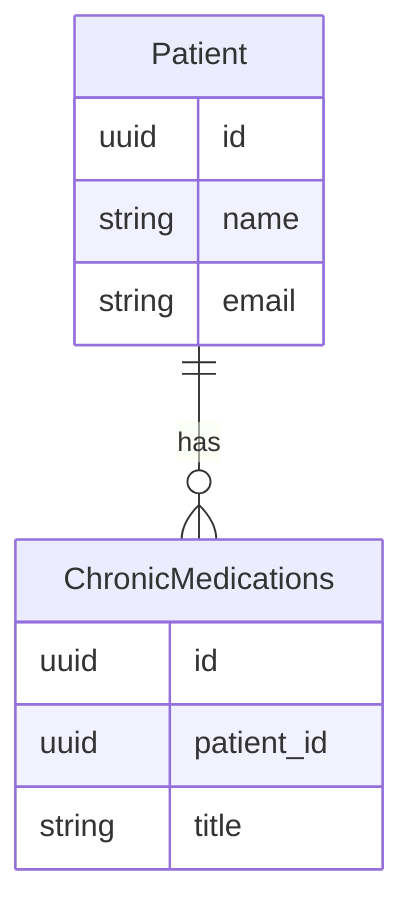

# Chronic Medications API Contract (Flutter)

This document is the API contract for the **Chronic Medications** feature in Hakeem (patient-scoped chronic medications). It is intended for Flutter developers integrating against the Hakeem backend. It uses the Figma designs as the source of truth for UI and data points and includes examples and a deep dive into the feature. The API is **implemented** in the backend.

---

## 1. Overview and Authentication

### Base URL

All routes are prefixed with `/api`. Base URL: `https://hakeem.mustafafares.com/api`.

### Authentication

All Chronic Medications endpoints require authentication via **Laravel Sanctum**:

- **Header:** `Authorization: Bearer <token>`
- **Obtain token:** `POST /api/auth/login` with `username` and `password` (or `email` and `password`, depending on backend configuration).

Unauthenticated requests receive **401 Unauthorized**.

### Tenancy

The backend is multi-tenant. The authenticated user’s tenant context is applied automatically; you do **not** send a tenant ID in requests.

### Request and Response Format

- **Content-Type:** `application/json`
- **Request body and query parameters:** **camelCase** (e.g. `patientId`, `title`)
- **Response body:** **camelCase** (Laravel API Resources return camelCase keys)

---

## 2. Entity Relationship Diagram



- **Patient** (1) → (N) **ChronicMedications** (patient-scoped chronic medications)

---

## 3. Enums (Source of Truth for Dropdowns)

No enums for this feature. The **title** field is free text (medication title/description).

---

## 4. Chronic Medications Endpoints

### List Chronic Medications

**`GET /api/chronic_medications`**

Used for: **Patient profile – “Chronic Medications” tab**; filter by `patientId` to show one patient’s chronic medications.

**Query parameters:**

| Parameter | Type | Description |
|-----------|------|-------------|
| `perPage` | integer | Page size (1–100). Default: 20 |
| `filter[patientId]` | UUID | Filter by patient |
| `filter[title]` | string | Partial match on title |
| `filter[createdAfter]` | date | Created at ≥ |
| `filter[createdBefore]` | date | Created at ≤ |
| `search` | string | Search across patient_id and title |
| `sort` | string | `patientId`, `-patientId`, `title`, `-title`. Default: `-created_at` |

**Response:** Paginated collection with `data`, `links`, `meta`. Each item follows the Chronic Medication resource shape below.

---

### Create Chronic Medication

**`POST /api/chronic_medications`**

Used for: **New Patient form** or **Patient profile – Chronic Medications** “+ Add”.

**Request body:**

| Field | Type | Required | Validation |
|-------|------|----------|------------|
| `patientId` | UUID | Yes | Must exist in `patients` |
| `title` | string | Yes | Max 255 |

**Response:** `201 Created`. Full chronic medication resource in `data` and `message`.

---

### Show Chronic Medication

**`GET /api/chronic_medications/{id}`**

**Response:** `200 OK`. Single chronic medication resource.

---

### Update Chronic Medication

**`PUT /api/chronic_medications/{id}`** or **`PATCH /api/chronic_medications/{id}`**

**Request body:** Same fields as create, all optional: `patientId`, `title`. When provided, same validation applies.

**Response:** `200 OK`. Full chronic medication resource.

---

### Delete Chronic Medication

**`DELETE /api/chronic_medications/{id}`**

**Response:** `200 OK`. Deleted resource in `data` and `message`.

---

### Chronic Medication Resource Shape (camelCase)

| Field | Type | Description |
|-------|------|-------------|
| `id` | string (UUID) | Primary key |
| `patientId` | string (UUID) | Patient reference |
| `title` | string | Medication title/description |
| `createdAt` | string | ISO date-time |
| `updatedAt` | string | ISO date-time |

---

## 5. Related Endpoints (Figma Dropdowns and Patient Context)

| Purpose | Method | Endpoint | Use in UI |
|---------|--------|----------|-----------|
| Patient profile – Chronic Medications tab | GET | `/api/chronic_medications?filter[patientId]={patientId}` | List patient’s chronic medications |
| Single patient | GET | `/api/patients/{id}` | Patient context; see [Patient Management API contract](patient-management-api-contract.md) |
| New Patient form – Chronic Medications “+ Add” | POST | `/api/chronic_medications` | After creating patient, call with new `patientId` for each entry |

---

## 6. Deep Dive: Mapping Figma to API

### Screen: Patient Profile – “Chronic Medications” Tab

| Figma element | API / action |
|----------------|--------------|
| List of chronic medications | `GET /api/chronic_medications?filter[patientId]={patientId}&sort=-created_at` |
| “+ Add” | `POST /api/chronic_medications` with `patientId` and `title` |
| Edit entry | `PUT /api/chronic_medications/{id}` with `patientId`, `title` |
| Delete entry | `DELETE /api/chronic_medications/{id}` |

### Screen: New Patient Form – Chronic Medications Section

After creating the patient via `POST /api/patients`, call `POST /api/chronic_medications` for each chronic medication entry with the returned `patientId`.

---

## 7. Request/Response Examples

### Example: List Chronic Medications for a Patient

**Request**

```http
GET /api/chronic_medications?filter[patientId]=9d4e2c1a-1234-5678-abcd-000000000001&sort=-created_at
Authorization: Bearer <token>
```

**Response (200 OK)** — Paginated list; `data` is an array of chronic medication resources.

### Example: Create Chronic Medication

**Request**

```http
POST /api/chronic_medications
Content-Type: application/json
Authorization: Bearer <token>
```

```json
{
  "patientId": "9d4e2c1a-1234-5678-abcd-000000000001",
  "title": "Metformin 500 mg, twice daily with meals."
}
```

**Response (201 Created)**

```json
{
  "data": {
    "id": "9d4e2c1a-5678-4321-abcd-111111111111",
    "patientId": "9d4e2c1a-1234-5678-abcd-000000000001",
    "title": "Metformin 500 mg, twice daily with meals.",
    "createdAt": "2025-01-15T10:00:00.000000Z",
    "updatedAt": "2025-01-15T10:00:00.000000Z"
  },
  "message": "Created successfully"
}
```

---

## 8. Error Handling and Validation

| Status | Meaning | Typical cause |
|--------|---------|----------------|
| **401 Unauthorized** | Unauthenticated | Missing or invalid Bearer token |
| **403 Forbidden** | Not allowed | User lacks permission (policy) |
| **404 Not Found** | Resource missing | Invalid UUID or deleted chronic medication |
| **422 Unprocessable Entity** | Validation failed | Invalid or missing fields (e.g. `patientId`, `title`) |

**422 response body** example:

```json
{
  "message": "The given data was invalid.",
  "errors": {
    "patientId": ["The selected patient id is invalid."],
    "title": ["The title field is required."]
  }
}
```

**Validation rules (quick reference):**

- **Chronic medication:** `patientId` (required, UUID, exists in patients), `title` (required, max 255). Update: same fields optional but when provided must pass same rules.

---

## 9. Flutter-Oriented Notes

- **JSON keys:** Use **camelCase** for all request and response keys.
- **IDs:** All resource IDs are **UUID** strings.
- **Pagination:** Use `meta.current_page`, `meta.last_page`, `links.next` / `links.prev`; control page size with `perPage`.
- For the patient’s Chronic Medications tab, always filter by `patientId`.

---

## 10. Implementation Status

The Chronic Medications API is **implemented** in the backend.
