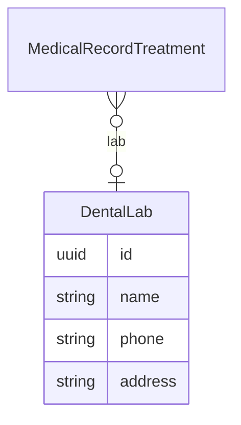

# Dental Labs API Contract (Flutter)

This document is the API contract for the **Dental Labs** feature in Hakeem. It is intended for Flutter developers integrating against the Hakeem backend. It uses the Figma designs as the source of truth for UI and data points and includes examples and a deep dive into the feature. Dental labs are used as a lookup in medical record treatments and tooth details. The API is **implemented** in the backend.

---

## 1. Overview and Authentication

### Base URL

All routes are prefixed with `/api`. Base URL: `https://hakeem.mustafafares.com/api`.

### Authentication

All Dental Lab endpoints require authentication via **Laravel Sanctum**:

- **Header:** `Authorization: Bearer <token>`
- **Obtain token:** `POST /api/auth/login` with `username` and `password`.

Unauthenticated requests receive **401 Unauthorized**.

### Tenancy

The backend is multi-tenant. The authenticated user’s tenant context is applied automatically; you do **not** send a tenant ID in requests.

### Request and Response Format

- **Content-Type:** `application/json`
- **Request body and query parameters:** **camelCase** (e.g. `name`, `phone`, `address`)
- **Response body:** **camelCase** (Laravel API Resources return camelCase keys)

---

## 2. Entity Relationship Diagram



- **DentalLab** is a lookup entity. **MedicalRecordTreatment** (N) → (0..1) **DentalLab**. See [Medical Record API contract](medical-record-api-contract.md).

---

## 3. Enums (Source of Truth for Dropdowns)

No enums for this feature. Dental lab fields are free-form (name, phone, address).

---

## 4. Dental Labs Endpoints

### List Dental Labs

**`GET /api/dental-labs`**

Used for: **“Dental Lab” dropdown** in medical record treatment sessions and tooth details. See [Medical Record API contract](medical-record-api-contract.md).

**Query parameters:**

| Parameter | Type | Description |
|-----------|------|-------------|
| `perPage` | integer | Page size (1–100). Default: 20 |
| `filter[name]` | string | Partial match on name |
| `filter[phone]` | string | Partial match on phone |
| `filter[address]` | string | Partial match on address |
| `filter[createdAfter]` | date | Created at ≥ |
| `filter[createdBefore]` | date | Created at ≤ |
| `search` | string | Search across name, phone, address |
| `sort` | string | `name`, `-name`, `phone`, `-phone`, `address`, `-address`. Default: `-created_at` |

**Response:** Paginated collection with `data`, `links`, `meta`. Each item follows the Dental Lab resource shape below.

---

### Create Dental Lab

**`POST /api/dental-labs`**

**Request body:**

| Field | Type | Required | Validation |
|-------|------|----------|------------|
| `name` | string | Yes | Max 255 |
| `phone` | string | No | Max 20 |
| `address` | string | No | Max 255 |

**Response:** `201 Created`. Full dental lab resource in `data` and `message`.

---

### Show Dental Lab

**`GET /api/dental-labs/{id}`**

**Response:** `200 OK`. Single dental lab resource.

---

### Update Dental Lab

**`PUT /api/dental-labs/{id}`** or **`PATCH /api/dental-labs/{id}`**

**Request body:** Same fields as create, all optional: `name`, `phone`, `address`.

**Response:** `200 OK`. Full dental lab resource.

---

### Delete Dental Lab

**`DELETE /api/dental-labs/{id}`**

**Response:** `200 OK`. Deleted resource in `data` and `message`.

---

### Dental Lab Resource Shape (camelCase)

| Field | Type | Description |
|-------|------|-------------|
| `id` | string (UUID) | Primary key |
| `name` | string | Lab name |
| `phone` | string \| null | Phone number |
| `address` | string \| null | Address |
| `createdAt` | string | ISO date-time |
| `updatedAt` | string | ISO date-time |

---

## 5. Related Endpoints (Figma Dropdowns and Context)

| Purpose | Method | Endpoint | Use in UI |
|---------|--------|----------|-----------|
| Dental Lab dropdown (medical record treatment session) | GET | `/api/dental-labs` | “Dental Lab” in treatment session; pass selected ID as `dentalLabId` when creating/updating a medical record treatment |
| Tooth Details card | GET | `/api/medical-record-treatments/{id}` (with `dentalLab` loaded) | Display dental lab name from relation |
| See Medical Record API | — | [Medical Record API contract](medical-record-api-contract.md) | Treatment sessions and tooth overview |

---

## 6. Deep Dive: Mapping Figma to API

### Screen: Medical Record – Treatment Session “Dental Lab”

| Figma element | API / action |
|----------------|--------------|
| “Dental Lab” dropdown | `GET /api/dental-labs?perPage=50&sort=name`; pass selected `id` as `dentalLabId` in `POST /api/medical-record-treatments` or `PUT /api/medical-record-treatments/{id}` |

---

## 7. Request/Response Examples

### Example: List Dental Labs (for dropdown)

**Request**

```http
GET /api/dental-labs?perPage=50&sort=name
Authorization: Bearer <token>
```

**Response (200 OK)** — Paginated list; `data` is an array of dental lab resources.

### Example: Create Dental Lab

**Request**

```http
POST /api/dental-labs
Content-Type: application/json
Authorization: Bearer <token>
```

```json
{
  "name": "Smile Dental Lab",
  "phone": "+1234567890",
  "address": "123 Lab Street"
}
```

**Response (201 Created)**

```json
{
  "data": {
    "id": "9d4e2c1a-5678-4321-abcd-111111111111",
    "name": "Smile Dental Lab",
    "phone": "+1234567890",
    "address": "123 Lab Street",
    "createdAt": "2025-01-15T10:00:00.000000Z",
    "updatedAt": "2025-01-15T10:00:00.000000Z"
  },
  "message": "Created successfully"
}
```

---

## 8. Error Handling and Validation

| Status | Meaning | Typical cause |
|--------|---------|----------------|
| **401 Unauthorized** | Unauthenticated | Missing or invalid Bearer token |
| **403 Forbidden** | Not allowed | User lacks permission (policy) |
| **404 Not Found** | Resource missing | Invalid UUID or deleted dental lab |
| **422 Unprocessable Entity** | Validation failed | Invalid or missing fields (e.g. `name`) |

**422 response body** example:

```json
{
  "message": "The given data was invalid.",
  "errors": {
    "name": ["The name field is required."]
  }
}
```

**Validation rules (quick reference):**

- **Dental lab:** `name` (required, max 255), `phone` (optional, max 20), `address` (optional, max 255). Update: same fields optional.

---

## 9. Flutter-Oriented Notes

- **JSON keys:** Use **camelCase** for all request and response keys.
- **IDs:** All resource IDs are **UUID** strings.
- **Pagination:** Use `meta.current_page`, `meta.last_page`, `links.next` / `links.prev`; control page size with `perPage`.

---

## 10. Implementation Status

The Dental Labs API is **implemented** in the backend.
