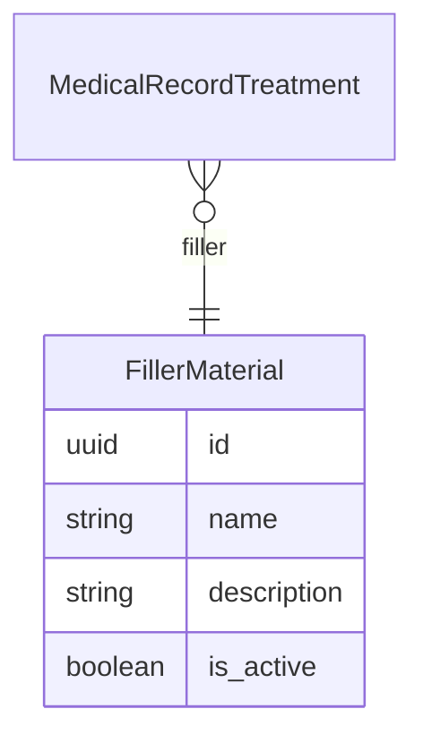

# Filler Materials API Contract (Flutter)

This document is the API contract for the **Filler Materials** feature in Hakeem. It is intended for Flutter developers integrating against the Hakeem backend. It uses the Figma designs as the source of truth for UI and data points and includes examples and a deep dive into the feature. Filler materials are used as a lookup in medical record treatment sessions (e.g. Composite resin, Amalgam, IRM). The API is **implemented** in the backend.

---

## 1. Overview and Authentication

### Base URL

All routes are prefixed with `/api`. Base URL: `https://hakeem.mustafafares.com/api`.

### Authentication

All Filler Material endpoints require authentication via **Laravel Sanctum**:

- **Header:** `Authorization: Bearer <token>`
- **Obtain token:** `POST /api/auth/login` with `username` and `password`.

Unauthenticated requests receive **401 Unauthorized**.

### Tenancy

The backend is multi-tenant. The authenticated user’s tenant context is applied automatically; you do **not** send a tenant ID in requests.

### Request and Response Format

- **Content-Type:** `application/json`
- **Request body and query parameters:** **camelCase** (e.g. `name`, `description`, `isActive`)
- **Response body:** **camelCase** (Laravel API Resources return camelCase keys)

---

## 2. Entity Relationship Diagram



- **FillerMaterial** is a lookup entity. **MedicalRecordTreatment** (N) → (1) **FillerMaterial** (required). See [Medical Record API contract](medical-record-api-contract.md).

---

## 3. Enums (Source of Truth for Dropdowns)

No enums for this feature. Filler material fields are free-form (name, description, isActive).

---

## 4. Filler Materials Endpoints

### List Filler Materials

**`GET /api/filler-materials`**

Used for: **“Filler Material” dropdown** in medical record treatment sessions. See [Medical Record API contract](medical-record-api-contract.md).

**Query parameters:**

| Parameter | Type | Description |
|-----------|------|-------------|
| `perPage` | integer | Page size (1–100). Default: 20 |
| `filter[name]` | string | Partial match on name |
| `filter[description]` | string | Partial match on description |
| `filter[isActive]` | boolean | Exact match (true/false) |
| `filter[createdAfter]` | date | Created at ≥ |
| `filter[createdBefore]` | date | Created at ≤ |
| `search` | string | Search across name and description |
| `sort` | string | `name`, `-name`, `createdAt`, `-createdAt`. Default: `-created_at` |

**Response:** Paginated collection with `data`, `links`, `meta`. Each item follows the Filler Material resource shape below.

---

### Create Filler Material

**`POST /api/filler-materials`**

**Request body:**

| Field | Type | Required | Validation |
|-------|------|----------|------------|
| `name` | string | Yes | Max 255 |
| `description` | string | No | Max 1000 |
| `isActive` | boolean | No | Default true when omitted |

**Response:** `201 Created`. Full filler material resource in `data` and `message`.

---

### Show Filler Material

**`GET /api/filler-materials/{id}`**

**Response:** `200 OK`. Single filler material resource.

---

### Update Filler Material

**`PUT /api/filler-materials/{id}`** or **`PATCH /api/filler-materials/{id}`**

**Request body:** Same fields as create, all optional: `name`, `description`, `isActive`.

**Response:** `200 OK`. Full filler material resource.

---

### Delete Filler Material

**`DELETE /api/filler-materials/{id}`**

**Response:** `200 OK`. Deleted resource in `data` and `message`.

---

### Filler Material Resource Shape (camelCase)

| Field | Type | Description |
|-------|------|-------------|
| `id` | string (UUID) | Primary key |
| `name` | string | Material name (e.g. “Composite resin”, “Amalgam Filling”, “Temporary filling (IRM)”) |
| `description` | string \| null | Description |
| `isActive` | boolean | Whether the material is active for selection |
| `createdAt` | string | ISO date-time |
| `updatedAt` | string | ISO date-time |

---

## 5. Related Endpoints (Figma Dropdowns and Context)

| Purpose | Method | Endpoint | Use in UI |
|---------|--------|----------|-----------|
| Filler Material dropdown (medical record treatment session) | GET | `/api/filler-materials` | “Filler Material” in treatment session (required); pass selected ID as `fillerMaterialId` when creating/updating a medical record treatment |
| Tooth Overview legend / Tooth Details | GET | `/api/medical-record-treatments/{id}` (with `fillerMaterial` loaded) | Display filler material name; map to chart colors (e.g. Composite resin, Amalgam, IRM) |
| See Medical Record API | — | [Medical Record API contract](medical-record-api-contract.md) | Treatment sessions and tooth overview |

---

## 6. Deep Dive: Mapping Figma to API

### Screen: Medical Record – Treatment Session “Filler Material”

| Figma element | API / action |
|----------------|--------------|
| “Filler Material” dropdown | `GET /api/filler-materials?perPage=50&sort=name&filter[isActive]=true`; pass selected `id` as `fillerMaterialId` (required) in `POST /api/medical-record-treatments` or `PUT /api/medical-record-treatments/{id}` |

---

## 7. Request/Response Examples

### Example: List Filler Materials (for dropdown)

**Request**

```http
GET /api/filler-materials?perPage=50&sort=name&filter[isActive]=true
Authorization: Bearer <token>
```

**Response (200 OK)** — Paginated list; `data` is an array of filler material resources.

### Example: Create Filler Material

**Request**

```http
POST /api/filler-materials
Content-Type: application/json
Authorization: Bearer <token>
```

```json
{
  "name": "Composite resin",
  "description": "Tooth-colored filling material",
  "isActive": true
}
```

**Response (201 Created)**

```json
{
  "data": {
    "id": "9d4e2c1a-5678-4321-abcd-111111111111",
    "name": "Composite resin",
    "description": "Tooth-colored filling material",
    "isActive": true,
    "createdAt": "2025-01-15T10:00:00.000000Z",
    "updatedAt": "2025-01-15T10:00:00.000000Z"
  },
  "message": "Created successfully"
}
```

---

## 8. Error Handling and Validation

| Status | Meaning | Typical cause |
|--------|---------|----------------|
| **401 Unauthorized** | Unauthenticated | Missing or invalid Bearer token |
| **403 Forbidden** | Not allowed | User lacks permission (policy) |
| **404 Not Found** | Resource missing | Invalid UUID or deleted filler material |
| **422 Unprocessable Entity** | Validation failed | Invalid or missing fields (e.g. `name`) |

**422 response body** example:

```json
{
  "message": "The given data was invalid.",
  "errors": {
    "name": ["The name field is required."]
  }
}
```

**Validation rules (quick reference):**

- **Filler material:** `name` (required, max 255), `description` (optional, max 1000), `isActive` (optional, boolean). Update: same fields optional.

---

## 9. Flutter-Oriented Notes

- **JSON keys:** Use **camelCase** for all request and response keys.
- **IDs:** All resource IDs are **UUID** strings.
- **Pagination:** Use `meta.current_page`, `meta.last_page`, `links.next` / `links.prev`; control page size with `perPage`.
- For “Select Filler Material” dropdown, filter by `filter[isActive]=true` to show only active materials.

---

## 10. Implementation Status

The Filler Materials API is **implemented** in the backend.
