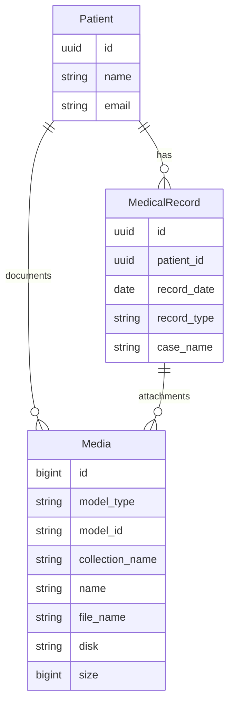

# Media (Files/Documents) API Contract (Flutter)

This document is the API contract for the **Media (Files/Documents)** feature in Hakeem. It is intended for Flutter developers integrating against the Hakeem backend. It aligns with the Files/Documents UI (tabs: Laboratory Tests, Imaging Scans, Other) and describes list, upload, show, and delete operations for patient and medical-record attachments.

---

## 1. Overview and Authentication

### Base URL

All routes are prefixed with `/api`. Base URL: `https://hakeem.mustafafares.com/api`.

### Authentication

All Media endpoints require authentication via **Laravel Sanctum**:

- **Header:** `Authorization: Bearer <token>`
- **Obtain token:** `POST /api/auth/login` with `username` and `password`.

Unauthenticated requests receive **401 Unauthorized**.

### Tenancy

The backend is multi-tenant. The authenticated user’s tenant context is applied automatically; you do **not** send a tenant ID in requests. Media listed and uploaded are scoped to the current tenant (via Patient and MedicalRecord).

### Request and Response Format

- **Content-Type:** `application/json` (use `multipart/form-data` for uploads)
- **Request body and query parameters:** **camelCase** (e.g. `patientId`, `patientAndMedicalRecords`, `collectionName`)
- **Response body:** **camelCase** (Laravel API Resources return camelCase keys)

---

## 2. Entity Relationship Diagram



- **Patient** (1) → (N) **Media** (polymorphic: `model_type` = Patient, `model_id` = patient id). Used for patient-level documents (e.g. general check-up results).
- **MedicalRecord** (1) → (N) **Media** (polymorphic: `model_type` = MedicalRecord, `model_id` = medical record id). Used for record-specific attachments (e.g. X-rays, lab results for a case).
- Media is stored via **Spatie Media Library**; each item has a **collection** (e.g. `laboratory-tests`, `imaging-scans`, `documents`, `other`).

---

## 3. Collections (Files/Documents Tabs)

The Files/Documents UI uses tabs to filter by **collection**. Use the same collection names when uploading and when filtering the list.

| API Value (collection) | Display Label   | Use in UI                    |
|------------------------|-----------------|------------------------------|
| `laboratory-tests`     | Laboratory Tests| Tab: lab results, blood work |
| `imaging-scans`        | Imaging Scans   | Tab: X-rays, scans           |
| `documents`            | Other           | General documents             |
| `other`                | Other           | Default collection; general   |

- **List:** Use `filter[collectionName]=laboratory-tests` (or `imaging-scans`, `documents`, `other`) to show only media in that collection.
- **Upload:** Send `collection` in the request body (e.g. `laboratory-tests`); if omitted, backend defaults to `other`.

---

## 4. Media Endpoints

### List Media (Files/Documents for a Patient)

**`GET /api/media`**

Used for: **Files/Documents** section for a given patient (all documents for that patient and their medical records, optionally filtered by collection tab).

**Query parameters:**

| Parameter | Type | Required | Description |
|-----------|------|----------|-------------|
| `perPage` | integer | No | Page size (1–100). Default: 20 |
| `filter[patientAndMedicalRecords]` | UUID | **Yes** | Patient ID. Returns media attached to the patient **and** to all medical records of that patient (current tenant). |
| `filter[collectionName]` | string | No | Filter by collection (e.g. `laboratory-tests`, `imaging-scans`, `documents`, `other`). Matches the Files/Documents tabs. |
| `filter[createdAfter]` | date (Y-m-d) | No | Created at ≥ |
| `filter[createdBefore]` | date (Y-m-d) | No | Created at ≤ |
| `sort` | string | No | `name`, `-name`, `fileName`, `-fileName`, `size`, `-size`, `createdAt`, `-createdAt`. Default: `-createdAt` |

**Response:** Paginated collection with `data`, `links`, `meta`. Each item is a Media resource (see Media Resource Shape below).

**Usage:**

- **All files for patient:** `GET /api/media?filter[patientAndMedicalRecords]={patientId}`
- **Laboratory Tests tab:** `GET /api/media?filter[patientAndMedicalRecords]={patientId}&filter[collectionName]=laboratory-tests`
- **Imaging Scans tab:** `GET /api/media?filter[patientAndMedicalRecords]={patientId}&filter[collectionName]=imaging-scans`
- **Other tab:** `GET /api/media?filter[patientAndMedicalRecords]={patientId}&filter[collectionName]=documents` (or `other`)

**Validation:** If `filter[patientAndMedicalRecords]` is missing or invalid, the API returns **422 Unprocessable Entity** with validation errors.

---

### Create Media (Add Files)

**`POST /api/media`**

Triggered by the **“Add Files”** button. Uploads one or more files and attaches them to a patient or to a specific medical record.

**Request:** `Content-Type: multipart/form-data`

| Field | Type | Required | Validation |
|-------|------|----------|------------|
| `patientId` | UUID | Yes | Must exist in `patients` (current tenant) |
| `medicalRecordId` | UUID | No | If provided, must exist in `medical_records` and belong to `patientId`. Files are attached to the medical record. If omitted, files are attached to the patient. |
| `files` | file[] | Yes | One or more files. Max size per file: 10 MB. |
| `collection` | string | No | Collection name (e.g. `laboratory-tests`, `imaging-scans`, `other`). Default: `other`. |

**Response:** `201 Created`. Body includes `data` (single media resource if one file, or array of media resources if multiple files) and `message`.

---

### Show Media (Download / Preview)

**`GET /api/media/{id}`**

Used when the user clicks a file to preview or obtain the download URL. The resource includes `url` and `thumbnailUrl` for display or download.

**Response:** `200 OK`. Single Media resource in `data` and `message`.

**Authorization:** The user must have permission to view the underlying model (Patient or MedicalRecord) that owns the media. Unauthorized access returns **403 Forbidden**.

---

### Delete Media

**`DELETE /api/media/{id}`**

Used when the user clicks the trash/delete icon on a file.

**Response:** `200 OK`. Deleted media resource in `data` and `message`.

**Authorization:** The user must have permission to delete the underlying model (Patient or MedicalRecord) that owns the media. Unauthorized access returns **403 Forbidden**.

---

## 5. Media Resource Shape (camelCase)

| Field | Type | Description |
|-------|------|-------------|
| `id` | integer | Primary key (media table uses bigint id) |
| `name` | string | Display name of the file |
| `fileName` | string | Stored file name |
| `collection` | string | Collection name (e.g. `laboratory-tests`, `imaging-scans`, `documents`) |
| `url` | string | Full URL to the file (for download or open) |
| `thumbnailUrl` | string | URL to thumbnail if available; otherwise same as `url` |
| `size` | string | Human-readable size (e.g. `175 KB`) |
| `extension` | string | File extension (e.g. `pdf`) |
| `type` | string | MIME-derived type (e.g. `pdf`, `image`) |
| `caption` | string | Caption or custom label; falls back to `name` |
| `createdAt` | string | ISO date-time |

---

## 6. Related Endpoints

| Purpose | Method | Endpoint | Use in UI |
|---------|--------|----------|-----------|
| Patient list (context) | GET | `/api/patients` | Resolve patient ID for Files/Documents section |
| Medical records (optional target) | GET | `/api/medical-records?filter[patientId]={id}` | “Add Files” – optionally attach to a specific record |

Media is always scoped by patient (and optionally by medical record) and by the current tenant; no separate “media types” or “categories” endpoint is required beyond the collection filter and the resource shape above.

---

## 7. Deep Dive: Mapping UI to API

### Screen: Files/Documents

| UI element | API / action |
|------------|--------------|
| Title “Files/Documents” | Section title; data from `GET /api/media?filter[patientAndMedicalRecords]={patientId}` |
| “Add Files” button | `POST /api/media` with `patientId`, `files`, optional `medicalRecordId` and `collection` |
| Tab “Laboratory Tests” | `GET /api/media?filter[patientAndMedicalRecords]={patientId}&filter[collectionName]=laboratory-tests` |
| Tab “Imaging Scans” | `GET /api/media?filter[patientAndMedicalRecords]={patientId}&filter[collectionName]=imaging-scans` |
| Tab “Other” | `GET /api/media?filter[patientAndMedicalRecords]={patientId}&filter[collectionName]=documents` or `other` |
| Search icon | Client-side filter on current list, or future `search` query parameter if backend adds it |
| File row (name, size) | One item from list `data`; display `name`, `fileName`, `size`, `caption` |
| Download icon | Use `url` from the media resource (open in browser or trigger download) |
| Delete (trash) icon | `DELETE /api/media/{id}` |

---

## 8. Request/Response Examples

### Example: List All Documents for a Patient

**Request**

```http
GET /api/media?filter[patientAndMedicalRecords]=9d4e2c1a-1234-5678-abcd-000000000001&perPage=20
Authorization: Bearer <token>
```

**Response (200 OK)** — Paginated list; `data` is an array of media resources.

### Example: List Laboratory Tests Only

**Request**

```http
GET /api/media?filter[patientAndMedicalRecords]=9d4e2c1a-1234-5678-abcd-000000000001&filter[collectionName]=laboratory-tests
Authorization: Bearer <token>
```

**Response (200 OK)** — Only media in the `laboratory-tests` collection for that patient and their medical records.

### Example: Upload a File to a Patient

**Request**

```http
POST /api/media
Authorization: Bearer <token>
Content-Type: multipart/form-data

patientId: 9d4e2c1a-1234-5678-abcd-000000000001
files: [file]
collection: laboratory-tests
```

**Response (201 Created)** — `data` contains the created media resource(s) and `message`.

### Example: Upload a File to a Medical Record

**Request**

```http
POST /api/media
Authorization: Bearer <token>
Content-Type: multipart/form-data

patientId: 9d4e2c1a-1234-5678-abcd-000000000001
medicalRecordId: a1b2c3d4-5678-90ab-cdef-000000000002
files: [file]
collection: imaging-scans
```

**Response (201 Created)** — File is attached to the specified medical record.

### Example: Missing Required Filter (422)

**Request**

```http
GET /api/media?perPage=10
Authorization: Bearer <token>
```

**Response (422 Unprocessable Entity)** — Validation error: `filter.patientAndMedicalRecords` is required.

---

## 9. Error Handling and Validation

| Status | Meaning | Typical cause |
|--------|---------|----------------|
| **401 Unauthorized** | Unauthenticated | Missing or invalid Bearer token |
| **403 Forbidden** | Not allowed | User lacks permission to view/delete the underlying model (Patient or MedicalRecord) |
| **404 Not Found** | Resource missing | Invalid media ID or deleted resource |
| **422 Unprocessable Entity** | Validation failed | Missing required filter, invalid UUIDs, or file validation (size, type) |

**422 response body** example (missing required filter):

```json
{
  "message": "The given data was invalid.",
  "errors": {
    "filter.patientAndMedicalRecords": ["The filter.patient and medical records field is required."]
  }
}
```

**Validation rules (quick reference):**

- **List:** `filter[patientAndMedicalRecords]` (required, UUID, must exist in patients).
- **Create:** `patientId` (required, UUID, exists), `medicalRecordId` (optional, UUID, exists, must belong to patient), `files` (required, one or more files, max 10 MB each), `collection` (optional, default `other`).

---

## 10. Flutter-Oriented Notes

- **JSON keys:** Use **camelCase** for all request and response keys (query params use camelCase for filter names).
- **Upload:** Use **multipart/form-data** for `POST /api/media`; send `patientId`, `files`, and optionally `medicalRecordId` and `collection`.
- **IDs:** Patient and medical record IDs are **UUID** strings; media `id` is an integer (bigint).
- **Pagination:** Use `meta.current_page`, `meta.last_page`, `links.next` / `links.prev`; control page size with `perPage`.
- **Collections:** Use `filter[collectionName]` for list (e.g. `laboratory-tests`, `imaging-scans`, `documents`, `other`) and `collection` on upload to match Files/Documents tabs.
