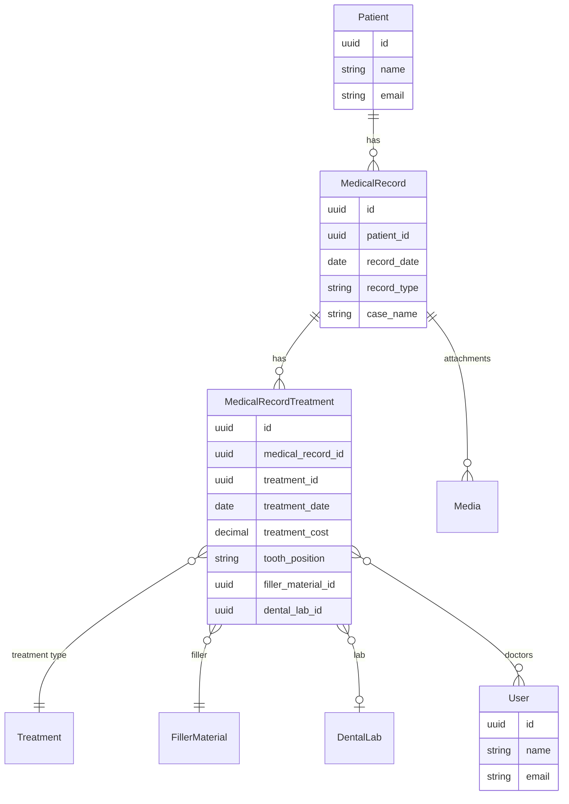

# Medical Record API Contract (Flutter)

This document is the API contract for the **Medical Record** feature in Hakeem. It is intended for Flutter developers integrating against the Hakeem backend. It uses the Figma designs as the source of truth for UI and data points and includes examples and a deep dive into the feature.

---

## 1. Overview and Authentication

### Base URL

All routes are prefixed with `/api`. Base URL: `https://hakeem.mustafafares.com/api`.

### Authentication

All Medical Record endpoints require authentication via **Laravel Sanctum**:

- **Header:** `Authorization: Bearer <token>`
- **Obtain token:** `POST /api/auth/login` with `username` and `password`.

Unauthenticated requests receive **401 Unauthorized**.

### Tenancy

The backend is multi-tenant. The authenticated user’s tenant context is applied automatically; you do **not** send a tenant ID in requests.

### Request and Response Format

- **Content-Type:** `application/json`
- **Request body and query parameters:** **camelCase** (e.g. `patientId`, `recordDate`, `recordType`)
- **Response body:** **camelCase** (Laravel API Resources return camelCase keys)

---

## 2. Entity Relationship Diagram



- **Patient** (1) → (N) **MedicalRecord**
- **MedicalRecord** (1) → (N) **MedicalRecordTreatment**
- **MedicalRecordTreatment** (N) ↔ (N) **User** (doctors) via pivot `doctor_medical_record_treatment`
- **MedicalRecordTreatment** → **Treatment**, **FillerMaterial**, **DentalLab** (optional)
- **MedicalRecord** has **Media** (attachments) via Spatie Media Library

---

## 3. Enums (Source of Truth for Dropdowns)

### Record Type

Used for the **“Record type”** field on the Medical Record form (e.g. “In Clinic”, “External”).

| API Value   | Display Label |
|------------|----------------|
| `in_clinic` | In Clinic     |
| `external`  | External      |

### Tooth Position (FDI Notation)

Used for **“Tooth Type”** / **“Select Tooth”** in treatment sessions. All values are **strings**.

**Permanent teeth:**

- Upper right: `11`–`18`
- Upper left: `21`–`28`
- Lower left: `31`–`38`
- Lower right: `41`–`48`

**Primary (deciduous) teeth:**

- Upper right: `51`–`55`
- Upper left: `61`–`65`
- Lower left: `71`–`75`
- Lower right: `81`–`85`

Use these values as-is in `toothPosition` for medical record treatments. Display labels (e.g. “Tooth 16 - Upper Right First Molar”) can be derived from backend or a local map.

---

## 4. Medical Records Endpoints

### List Medical Records

**`GET /api/medical-records`**

**Query parameters:**

| Parameter | Type | Description |
|-----------|------|--------------|
| `perPage` | integer | Page size (1–100). Default: 20 |
| `filter[patientId]` | UUID | Filter by patient |
| `filter[recordType]` | string | `in_clinic` or `external` |
| `filter[caseName]` | string | Partial match on case name |
| `filter[description]` | string | Partial match on description |
| `filter[recordDateAfter]` | date (Y-m-d) | Record date ≥ |
| `filter[recordDateBefore]` | date (Y-m-d) | Record date ≤ |
| `filter[createdAfter]` | date | Created at ≥ |
| `filter[createdBefore]` | date | Created at ≤ |
| `search` | string | Search in case name and description |
| `sort` | string | `recordDate`, `-recordDate`, `caseName`, `-caseName`. Default: `-created_at` |

**Response:** Paginated collection with `data`, `links`, `meta`. Each item follows the Medical Record resource shape below.

---

### Create Medical Record

**`POST /api/medical-records`**

**Request body:**

| Field | Type | Required | Validation |
|-------|------|----------|------------|
| `patientId` | UUID | Yes | Must exist in `patients` |
| `recordDate` | string | Yes | Date, format `Y-m-d` |
| `recordType` | string | Yes | `in_clinic` or `external` |
| `caseName` | string | Yes | Max 255 |
| `description` | string | No | Max 1000 |
| `totalCost` | number | No | ≥ 0; when provided, creates an incoming billing linked to this record |
| `paidAmount` | number | No | ≥ 0; when provided with totalCost, creates incoming billing with this paid amount |

**Response:** `201 Created`. Body includes `data` (full medical record resource with `patient`, `treatments`, `attachments` when loaded) and `message`.

---

### Show Medical Record

**`GET /api/medical-records/{id}`**

**Response:** `200 OK`. Single medical record resource with `patient`, `treatments`, `attachments` loaded.

---

### Update Medical Record

**`PUT /api/medical-records/{id}`** or **`PATCH /api/medical-records/{id}`**

**Request body:** Same fields as create, all optional: `patientId`, `recordDate`, `recordType`, `caseName`, `description`, `totalCost`, `paidAmount`.

**Response:** `200 OK`. Full medical record resource.

---

### Delete Medical Record

**`DELETE /api/medical-records/{id}`**

**Response:** `200 OK`. Deleted resource in `data` and `message`.

---

### Medical Record Resource Shape (camelCase)

| Field | Type | Description |
|-------|------|-------------|
| `id` | string (UUID) | Primary key |
| `patientId` | string (UUID) | Patient reference |
| `patient` | object | Present when relation is loaded (e.g. show/create response) |
| `recordDate` | string | Date only, `YYYY-MM-DD` |
| `recordType` | string | `in_clinic` or `external` |
| `caseName` | string | Case title |
| `description` | string \| null | Case description |
| `totalCost` | number \| null | Max of linked billings’ total_cost when `billings` relation is loaded |
| `amountPaid` | number | Sum of linked billings’ paid_amount when `billings` relation is loaded (0 if none) |
| `remainingAmount` | number | totalCost − amountPaid when billings are loaded |
| `treatments` | array | List of medical record treatment resources when loaded |
| `attachments` | array | List of media objects when loaded |
| `createdAt` | string | ISO date-time |
| `updatedAt` | string | ISO date-time |

### Attachments (Media) Item Shape

| Field | Type | Description |
|-------|------|-------------|
| `id` | number/string | Media ID |
| `name` | string | Display name |
| `fileName` | string | File name |
| `collection` | string | Media collection name |
| `url` | string | Full URL to file |
| `thumbnailUrl` | string | Thumbnail URL (or same as `url`) |
| `size` | string | Human-readable size |
| `extension` | string | File extension |
| `type` | string | MIME type / type from extension |
| `caption` | string | Caption or name |
| `createdAt` | string | ISO date-time |

**Note:** File upload for medical record attachments is not defined in the current API routes. Confirm with the backend whether upload is via multipart on create/update or a dedicated media endpoint.

---

## 5. Medical Record Treatments Endpoints

### List Medical Record Treatments

**`GET /api/medical-record-treatments`**

**Query parameters:**

| Parameter | Type | Description |
|-----------|------|--------------|
| `perPage` | integer | 1–100, default 20 |
| `filter[medicalRecordId]` | UUID | Filter by medical record |
| `filter[treatmentId]` | UUID | Filter by treatment type |
| `filter[toothPosition]` | string | FDI value (e.g. `16`, `21`) |
| `filter[fillerMaterialId]` | UUID | Filter by filler material |
| `filter[dentalLabId]` | UUID | Filter by dental lab |
| `filter[treatmentDateAfter]` | date | Treatment date ≥ |
| `filter[treatmentDateBefore]` | date | Treatment date ≤ |
| `filter[createdAfter]` | date | Created at ≥ |
| `filter[createdBefore]` | date | Created at ≤ |
| `search` | string | Search in treatment description and tooth position |
| `sort` | string | `treatmentDate`, `-treatmentDate`, `treatmentCost`, `-treatmentCost`, `sessionNumber`, `-sessionNumber`. Default: `-created_at` |

**Response:** Paginated collection; each item follows the Medical Record Treatment resource shape below.

---

### Create Medical Record Treatment

**`POST /api/medical-record-treatments`**

**Request body:**

| Field | Type | Required | Validation |
|-------|------|----------|------------|
| `medicalRecordId` | UUID | Yes | Must exist in `medical_records` |
| `treatmentDate` | string | Yes | Date, `Y-m-d` |
| `fillerMaterialId` | UUID | Yes | Must exist in `filler_materials` |
| `treatmentId` | UUID | No | Must exist in `treatments` |
| `toothPosition` | string | No | FDI enum value (e.g. `11`–`48`, `51`–`85`) |
| `treatmentCost` | number | No | ≥ 0 |
| `treatmentDescription` | string | No | Max 1000 |
| `dentalLabId` | UUID | No | Must exist in `dental_labs` |
| `sessionNumber` | integer | No | ≥ 1, default 1 |
| `doctorIds` | array of UUID | No | User IDs; must exist in `users` |

**Response:** `201 Created`. Full medical record treatment resource with `treatment`, `dentalLab`, `doctors` when loaded.

---

### Show Medical Record Treatment

**`GET /api/medical-record-treatments/{id}`**

**Response:** `200 OK`. Single medical record treatment resource with relations loaded.

---

### Update Medical Record Treatment

**`PUT /api/medical-record-treatments/{id}`** or **`PATCH /api/medical-record-treatments/{id}`**

**Request body:** Same fields as create, all optional: `toothPosition`, `treatmentDate`, `treatmentCost`, `treatmentDescription`, `fillerMaterialId`, `treatmentId`, `dentalLabId`, `sessionNumber`, `doctorIds`.

**Response:** `200 OK`. Full medical record treatment resource.

---

### Delete Medical Record Treatment

**`DELETE /api/medical-record-treatments/{id}`**

**Response:** `200 OK`. Deleted resource in `data` and `message`.

---

### Medical Record Treatment Resource Shape (camelCase)

| Field | Type | Description |
|-------|------|-------------|
| `id` | string (UUID) | Primary key |
| `medicalRecordId` | string (UUID) | Medical record reference |
| `treatmentId` | string (UUID) \| null | Treatment type reference |
| `treatment` | object | Treatment resource when loaded (id, name, description, defaultCost, etc.) |
| `treatmentDate` | string | Date only, `YYYY-MM-DD` |
| `treatmentCost` | string (decimal) | Cost for this session |
| `treatmentDescription` | string \| null | Session notes |
| `toothPosition` | string \| null | FDI tooth code |
| `fillerMaterialId` | string (UUID) | Filler material reference |
| `fillerMaterial` | object | Filler material resource when loaded |
| `dentalLabId` | string (UUID) \| null | Dental lab reference |
| `dentalLab` | object | Dental lab resource when loaded |
| `sessionNumber` | integer | Session index (e.g. 1st, 2nd) |
| `doctors` | array | User resources when loaded (doctors for this session) |
| `createdAt` | string | ISO date-time |
| `updatedAt` | string | ISO date-time |

---

## 6. Related Endpoints (Figma Dropdowns and Patient Context)

| Purpose | Method | Endpoint | Use in UI |
|---------|--------|----------|-----------|
| Patient list / select | GET | `/api/patients` | Patient selector, patient list |
| Single patient | GET | `/api/patients/{id}` | Patient profile header, edit patient |
| Create patient | POST | `/api/patients` | New Patient form |
| Update patient | PUT/PATCH | `/api/patients/{id}` | Edit Patient |
| Delete patient | DELETE | `/api/patients/{id}` | Delete patient |
| Tooth overview | GET | `/api/patients/{patientId}/tooth-overview` | “Tooth Overview” / “Tooth Details” (chart + detail card) |
| Treatment dropdown | GET | `/api/treatments` | “Treatment Name” in treatment session |
| Filler material dropdown | GET | `/api/filler-materials` | “Filler Material” in treatment session |
| Dental lab dropdown | GET | `/api/dental-labs` | “Dental Lab” in tooth details |
| Doctors multi-select | GET | `/api/users` | “Select Doctor(s)” in treatment session |

**Tooth overview response** (`GET /api/patients/{patientId}/tooth-overview`):

- `patientId`, `patientName`, `age`, `toothType` (`primary` \| `permanent`), `medicalRecords` (array of medical record resources for that patient). Use `medicalRecords[].treatments` and tooth/filler/lab data to build the dental chart and tooth detail card.

**Treatment item** (from `/api/treatments`): `id`, `name`, `description`, `defaultCost`, `createdAt`, `updatedAt`.

**Filler material item** (from `/api/filler-materials`): `id`, `name`, `description`, `isActive`, `createdAt`, `updatedAt`.

**Dental lab item** (from `/api/dental-labs`): `id`, `name`, `phone`, `address`, `createdAt`, `updatedAt`.

**User/doctor item** (from `/api/users`): `id`, `name`, `email`, etc. Use for “Select Doctor(s)” and pass selected IDs as `doctorIds` when creating/updating a medical record treatment.

---

## 7. Deep Dive: Mapping Figma to API

### Screen: “Medical Record” Form (Create/Edit Case)

| Figma element | API field / action |
|--------------|--------------------|
| “Select Date Record” | `recordDate` (Y-m-d) |
| “Record type” dropdown | `recordType`: `in_clinic` or `external` |
| “Case Name” | `caseName` |
| “Description For This Case” | `description` |
| “Attach(s)” / “Upload File” | Shown from `attachments` in response; upload flow to be confirmed with backend |
| “Total Cost” | `totalCost` |
| “Remaining” | `remainingAmount` |
| “1st session Treatment” / “+” | One or more treatment sessions: create medical record first, then create each session via `POST /api/medical-record-treatments` with the returned `medicalRecord.id` |

### Treatment Session Block (Repeatable)

| Figma element | API field / source |
|---------------|--------------------|
| “Treatment Name” | `treatmentId` — options from `GET /api/treatments` |
| “Select Treatment Date” | `treatmentDate` (Y-m-d) |
| “Treatment Cost” | `treatmentCost` |
| “Treatment Desc” | `treatmentDescription` |
| “Tooth Type” | `toothPosition` — FDI enum (e.g. `11`–`48`, `51`–`85`) |
| “Filler Material” | `fillerMaterialId` — options from `GET /api/filler-materials` |
| “Select Doctor(s)” | `doctorIds` — options from `GET /api/users` |

### Screen: Patient Profile / “Medical Record” Tab (Timeline, Files, Tooth Overview)

| Figma element | API / action |
|---------------|-------------|
| Timeline list | `GET /api/medical-records?filter[patientId]={patientId}&sort=-recordDate` (and optional `perPage`) |
| “Preview” on entry | `GET /api/medical-records/{id}` |
| “Add Files” | Confirm with backend (multipart or dedicated media endpoint) |
| “Tooth Overview” / “Tooth Details” | `GET /api/patients/{patientId}/tooth-overview`; use `medicalRecords[].treatments` and tooth/filler/lab data for chart and detail card |

### Screen: “New Patient” Form (Medical Record Section)

Same mapping as the “Medical Record” form. Flow: create patient → create medical record with `patientId` → create one or more medical record treatments with `medicalRecordId`.

---

## 8. Request/Response Examples

### Example: Create Medical Record

**Request**

```http
POST /api/medical-records
Content-Type: application/json
Authorization: Bearer <token>
```

```json
{
  "patientId": "9d4e2c1a-1234-5678-abcd-000000000001",
  "recordDate": "2025-01-15",
  "recordType": "in_clinic",
  "caseName": "Deep dental cavity in the upper right first molar",
  "description": "A significant decay that has reached the dentin layer, causing sensitivity and potential infection if not treated promptly.",
  "totalCost": 350,
  "remainingAmount": 100
}
```

**Response (201 Created)**

```json
{
  "data": {
    "id": "9d4e2c1a-5678-4321-abcd-111111111111",
    "patientId": "9d4e2c1a-1234-5678-abcd-000000000001",
    "patient": { "id": "...", "name": "Dima Kassem", "email": "..." },
    "recordDate": "2025-01-15",
    "recordType": "in_clinic",
    "caseName": "Deep dental cavity in the upper right first molar",
    "description": "A significant decay that has reached the dentin layer...",
    "totalCost": "350.00",
    "remainingAmount": "100.00",
    "treatments": [],
    "attachments": [],
    "createdAt": "2025-01-15T10:00:00.000000Z",
    "updatedAt": "2025-01-15T10:00:00.000000Z"
  },
  "message": "Created successfully"
}
```

### Example: Create Medical Record Treatment

**Request**

```http
POST /api/medical-record-treatments
Content-Type: application/json
Authorization: Bearer <token>
```

```json
{
  "medicalRecordId": "9d4e2c1a-5678-4321-abcd-111111111111",
  "treatmentId": "9d4e2c1a-9999-4444-aaaa-222222222222",
  "treatmentDate": "2025-01-15",
  "treatmentCost": 175,
  "treatmentDescription": "Initial cleaning and cavity preparation",
  "toothPosition": "16",
  "fillerMaterialId": "9d4e2c1a-8888-3333-bbbb-333333333333",
  "sessionNumber": 1,
  "doctorIds": ["9d4e2c1a-7777-2222-cccc-444444444444"]
}
```

**Response (201 Created)** — `data` contains full medical record treatment resource with `treatment`, `fillerMaterial`, `doctors` loaded.

### Example: List Medical Records for a Patient

**Request**

```http
GET /api/medical-records?filter[patientId]=9d4e2c1a-1234-5678-abcd-000000000001&sort=-recordDate&perPage=10
Authorization: Bearer <token>
```

**Response (200 OK)** — Paginated list; `data` is an array of medical record resources. Use for the patient’s “Medical Record” tab timeline.

### Example: Get Tooth Overview

**Request**

```http
GET /api/patients/9d4e2c1a-1234-5678-abcd-000000000001/tooth-overview
Authorization: Bearer <token>
```

**Response (200 OK)**

```json
{
  "data": {
    "patientId": "9d4e2c1a-1234-5678-abcd-000000000001",
    "patientName": "Dima Kassem",
    "age": 25,
    "toothType": "permanent",
    "medicalRecords": [
      {
        "id": "...",
        "recordDate": "2025-01-15",
        "caseName": "Root Canal Treatment",
        "treatments": [
          {
            "id": "...",
            "treatmentDate": "2025-01-15",
            "toothPosition": "16",
            "treatment": { "name": "Initial Cleaning & Cavity Preparation" },
            "fillerMaterial": { "name": "Composite resin" },
            "dentalLab": { "name": "Smile Dental Lab" }
          }
        ]
      }
    ]
  },
  "message": "Retrieved successfully"
}
```

Use `medicalRecords` and their `treatments` (with `toothPosition`, `fillerMaterial`, `dentalLab`) to render the dental chart and “Tooth Details” card.

---

## 9. Error Handling and Validation

| Status | Meaning | Typical cause |
|--------|---------|----------------|
| **401 Unauthorized** | Unauthenticated | Missing or invalid Bearer token |
| **403 Forbidden** | Not allowed | User lacks permission (policy) |
| **404 Not Found** | Resource missing | Invalid UUID or deleted resource |
| **422 Unprocessable Entity** | Validation failed | Invalid or missing fields |

**422 response body** example:

```json
{
  "message": "The given data was invalid.",
  "errors": {
    "patientId": ["The selected patient id is invalid."],
    "recordDate": ["The record date field is required."]
  }
}
```

**Validation rules (quick reference):**

- **Medical record:** `patientId` (required, UUID, exists), `recordDate` (required, Y-m-d), `recordType` (required, enum), `caseName` (required, max 255), `description` (optional, max 1000), `totalCost` / `remainingAmount` (optional, numeric, min 0).
- **Medical record treatment:** `medicalRecordId` (required, UUID, exists), `treatmentDate` (required, Y-m-d), `fillerMaterialId` (required, UUID, exists), `treatmentId` / `dentalLabId` (optional, UUID, exists), `doctorIds` (optional array of UUIDs, each must exist in users).

---

## 10. Flutter-Oriented Notes

- **JSON keys:** Use **camelCase** everywhere; the API uses it for both request and response.
- **Dates:** Use **YYYY-MM-DD** for `recordDate` and `treatmentDate`; use full date-time strings for `createdAt` / `updatedAt`.
- **IDs:** All resource IDs are **UUID** strings.
- **Pagination:** Use `meta.current_page`, `meta.last_page`, `meta.per_page`, and `links.next` / `links.prev`; control page size with `perPage`.
- **“Add New Case” flow:**  
  1. `POST /api/medical-records` with patient and case details.  
  2. For each treatment session, `POST /api/medical-record-treatments` with `medicalRecordId` set to the `id` from step 1.
- **Attachments:** Display from `attachments` on the medical record. How to upload (multipart vs dedicated endpoint) should be confirmed with the backend.
