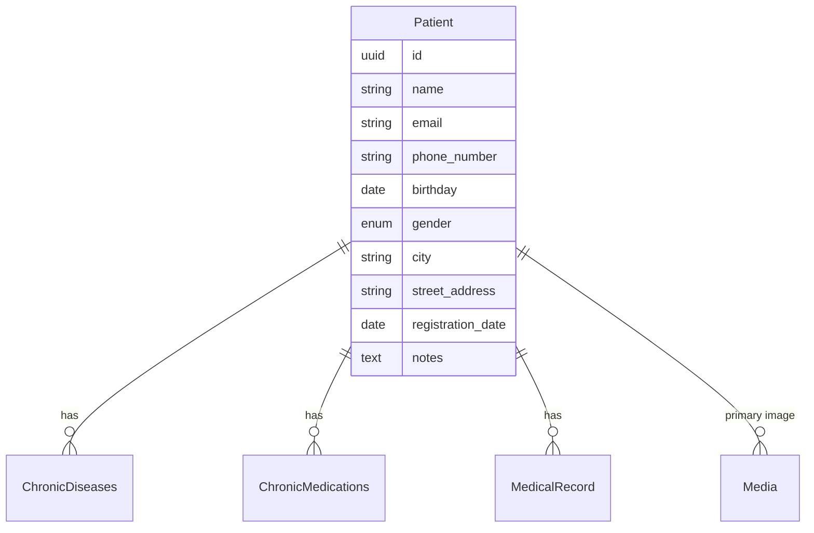

# Patient Management API Contract (Flutter)

This document is the API contract for the **Patient Management** feature in Hakeem. It is intended for Flutter developers integrating against the Hakeem backend. It covers the Patient List, New Patient / Edit Patient forms, patient profile (demographics, notes, tabs for Appointments, Medical Record, Chronic Diseases), and related data. The API is **implemented** in the backend.

---

## 1. Overview and Authentication

### Base URL

All routes are prefixed with `/api`. Base URL: `https://hakeem.mustafafares.com/api`.

### Authentication

All Patient endpoints require authentication via **Laravel Sanctum**:

- **Header:** `Authorization: Bearer <token>`
- **Obtain token:** `POST /api/auth/login` with `username` and `password`. For full login, logout, and password flows, see [Auth API contract](auth-api-contract.md).

Unauthenticated requests receive **401 Unauthorized**.

### Tenancy

The backend is multi-tenant. The authenticated user’s tenant context is applied automatically; you do **not** send a tenant ID in requests.

### Request and Response Format

- **Content-Type:** `application/json` for request body (use `multipart/form-data` when uploading `primaryImage`).
- **Request body and query parameters:** **camelCase** (e.g. `phoneNumber`, `streetAddress`, `registrationDate`).
- **Response body:** **camelCase** (Laravel API Resources return camelCase keys).

---

## 2. Entity Relationship Diagram



- **Patient** (1) → (N) **ChronicDiseases** (patient-specific chronic conditions).
- **Patient** (1) → (N) **ChronicMedications** (patient-specific chronic medications).
- **Patient** (1) → (N) **MedicalRecord** (see [Medical Record API contract](medical-record-api-contract.md)).
- **Patient** has one **primary image** (profile picture) via Spatie Media Library.

---

## 3. Enums (Source of Truth for Dropdowns)

### Gender

Used for the **“Gender”** field on the New Patient / Edit Patient form.

| API Value | Display Label |
|-----------|----------------|
| `male`    | Male           |
| `female`  | Female         |

---

## 4. Patients Endpoints

### List Patients

**`GET /api/patients`**

Used for: **Patient List** screen, and for dropdowns (e.g. “Select patient” in appointments or medical records).

**Query parameters:**

| Parameter | Type | Description |
|-----------|------|-------------|
| `perPage` | integer | Page size (1–100). Default: 20 |
| `filter[name]` | string | Partial match on name |
| `filter[email]` | string | Partial match on email |
| `filter[phoneNumber]` | string | Partial match on phone number |
| `filter[birthday]` | date (Y-m-d) | Exact match on birthday |
| `filter[gender]` | string | Exact: `male` or `female` |
| `filter[city]` | string | Partial match on city |
| `filter[streetAddress]` | string | Partial match on street address |
| `filter[registrationDate]` | date | Partial match on registration date |
| `filter[notes]` | string | Partial match on notes |
| `filter[createdAfter]` | date | Created at ≥ |
| `filter[createdBefore]` | date | Created at ≤ |
| `search` | string | Search across name, email, phone_number, gender, city, street_address, notes |
| `sort` | string | `name`, `-name`, `email`, `-email`, `phoneNumber`, `-phoneNumber`, `birthday`, `-birthday`, `gender`, `-gender`, `city`, `-city`, `streetAddress`, `-streetAddress`, `registrationDate`, `-registrationDate`, `notes`, `-notes`, `created_at`, `-created_at`. Default: `-created_at` |

**Response:** Paginated collection with `data`, `links`, `meta`. Each item follows the Patient resource shape below.

---

### Create Patient

**`POST /api/patients`**

Used for: **“New Patient”** form (Save). Send as **`multipart/form-data`** if including a profile image.

**Request body (JSON or form fields):**

| Field | Type | Required | Validation |
|-------|------|----------|------------|
| `name` | string | Yes | Max 255 |
| `email` | string | No | Email, max 255, unique among patients |
| `phoneNumber` | string | Yes | Max 255, unique among patients |
| `birthday` | string | No | Date, format `Y-m-d` |
| `gender` | string | Yes | `male` or `female` |
| `city` | string | No | Max 255 |
| `streetAddress` | string | No | Max 255 |
| `registrationDate` | string | Yes | Date, format `Y-m-d` |
| `notes` | string | No | Max 255 |
| `primaryImage` | file | No | Image file (jpeg, png, gif, svg, webp), max 2048 KB |

**Response:** `201 Created`. Body includes `data` (full patient resource with `primaryImage` when loaded) and `message`.

---

### Show Patient

**`GET /api/patients/{id}`**

Used for: **Patient profile** header and details (name, email, demographics, notes). Use with related endpoints for Appointments tab, Medical Record tab, Chronic Diseases tab, and Files.

**Response:** `200 OK`. Single patient resource with `primaryImage`, `lastAppointment`, and `firstAppointment` loaded (see Patient resource shape).

---

### Update Patient

**`PUT /api/patients/{id}`** or **`PATCH /api/patients/{id}`**

Used for: **“Edit Patient”** button on patient profile. Send as **`multipart/form-data`** if updating the profile image.

**Request body:** Same fields as create, all optional: `name`, `email`, `phoneNumber`, `birthday`, `gender`, `city`, `streetAddress`, `registrationDate`, `notes`, `primaryImage`. On update, `email` and `phoneNumber` must remain unique but can be unchanged (ignore current record).

**Response:** `200 OK`. Full patient resource with `primaryImage`.

---

### Delete Patient

**`DELETE /api/patients/{id}`**

**Response:** `200 OK`. Deleted resource in `data` and `message`.

---

### Tooth Overview (Patient-Specific)

**`GET /api/patients/{patientId}/tooth-overview`**

Used for: **Patient profile – “Medical Record” tab – “Tooth Overview” / “Tooth Details”** (dental chart and selected tooth details).

**Response:** `200 OK`. Not a raw patient resource; see [Medical Record API contract – Tooth overview](medical-record-api-contract.md#6-related-endpoints-for-figma-dropdowns-and-patient-context). Shape includes `patientId`, `patientName`, `age`, `toothType` (`primary` \| `permanent`), `medicalRecords` (array of medical records with treatments for this patient).

---

### Patient Resource Shape (camelCase)

| Field | Type | Description |
|-------|------|-------------|
| `id` | string (UUID) | Primary key |
| `name` | string | Full name |
| `email` | string \| null | Email (unique when set) |
| `phoneNumber` | string | Phone (unique) |
| `birthday` | string \| null | Date only, `YYYY-MM-DD` |
| `gender` | string | `male` or `female` |
| `city` | string \| null | City |
| `streetAddress` | string \| null | Street address |
| `registrationDate` | string | Date only, `YYYY-MM-DD` |
| `notes` | string \| null | Internal notes |
| `primaryImage` | object \| null | Media resource when loaded (see below) |
| `lastAppointment` | object \| null | Booking resource when loaded (only on `GET /api/patients/{id}`) |
| `firstAppointment` | object \| null | Booking resource when loaded (only on `GET /api/patients/{id}`) |
| `createdAt` | string | ISO date-time |
| `updatedAt` | string | ISO date-time |

**Primary image (media) shape:** Same as in [Medical Record API contract – Attachments](medical-record-api-contract.md#attachments-media-item-shape): `id`, `name`, `fileName`, `collection`, `url`, `thumbnailUrl`, `size`, `extension`, `type`, `caption`, `createdAt`.

---

## 5. Related Endpoints (Patient Profile Tabs and New Patient Form)

| Purpose | Method | Endpoint | Use in UI |
|---------|--------|----------|-----------|
| Patient list | GET | `/api/patients` | Patient List screen; patient selector elsewhere |
| Single patient | GET | `/api/patients/{id}` | Patient profile header, demographics, notes |
| Create patient | POST | `/api/patients` | New Patient form – Save |
| Update patient | PUT/PATCH | `/api/patients/{id}` | Edit Patient |
| Delete patient | DELETE | `/api/patients/{id}` | Delete patient (if exposed) |
| Tooth overview | GET | `/api/patients/{id}/tooth-overview` | Medical Record tab – Tooth Overview / Tooth Details |
| Patient’s medical records | GET | `/api/medical-records?filter[patientId]={id}` | Medical Record tab – timeline; see [Medical Record API contract](medical-record-api-contract.md) |
| Patient’s appointments | GET | `/api/bookings?filter[patientId]={id}` | Appointments tab – timeline; see [Booking API contract](booking-api-contract.md) |
| Patient’s chronic diseases | GET | `/api/chronic_diseases?filter[patientId]={id}` | Chronic Diseases tab; create/update via `/api/chronic_diseases` with `patientId` |
| Patient’s chronic medications | GET | `/api/chronic_medications?filter[patientId]={id}` | Chronic Medications tab; create/update via `/api/chronic_medications` with `patientId` |

**Files/Documents:** If the patient profile “Files/Documents” section (Laboratory Tests, Imaging Scans, Other) is backed by the same media or a separate API, confirm with the backend. Patient model uses Spatie Media Library for `primaryImage`; other file collections may be added per patient.

---

## 6. Deep Dive: Mapping Figma to API

### Screen: Patient List

| Figma element | API / action |
|---------------|--------------|
| List of patients | `GET /api/patients` with optional `search`, `filter`, `sort`, `perPage` |
| Search | Use `search` query parameter |
| Click row → open profile | `GET /api/patients/{id}` for header; then load tabs (appointments, medical record, chronic diseases) via their endpoints |

### Screen: Patient Profile (e.g. “Dima Kassem”)

| Figma element | API / action |
|---------------|--------------|
| Patient name, email, profile picture | From `GET /api/patients/{id}`: `name`, `email`, `primaryImage` |
| “15 Past” / “2 Upcoming” | From appointments: see [Booking API contract](booking-api-contract.md) (filter by `patientId`, date range) |
| Gender, Birthday, Phone, City, Street Address, Registered Date | From same patient resource: `gender`, `birthday`, `phoneNumber`, `city`, `streetAddress`, `registrationDate` |
| Notes card | `notes` from patient resource; edit via `PATCH /api/patients/{id}` with `notes` |
| “Edit Patient” button | Load form from patient resource; submit via `PUT /api/patients/{id}` |
| “Print” | Client-side print using patient and tab data already loaded |
| Tab: Appointments | `GET /api/bookings?filter[patientId]={id}&sort=-date` |
| Tab: Medical Record | `GET /api/medical-records?filter[patientId]={id}`; Tooth Overview: `GET /api/patients/{id}/tooth-overview` |
| Tab: Chronic Diseases | `GET /api/chronic_diseases?filter[patientId]={id}` |
| Files/Documents | Confirm with backend (patient media or separate document API) |

### Screen: New Patient / Edit Patient Form

| Figma element | API field / action |
|---------------|--------------------|
| Profile picture / “Upload image” | `primaryImage` (file upload); send as `multipart/form-data` on POST/PATCH |
| Patient name | `name` |
| Gender dropdown | `gender`: `male` or `female` |
| Birthday | `birthday` (Y-m-d) |
| Phone Number | `phoneNumber` |
| City (dropdown) | `city` (free text in API; dropdown options can be client-side or from a future lookup) |
| Street Address | `streetAddress` |
| Notes | `notes` |
| Chronic Diseases “+ Add” | After saving patient, create entries via `POST /api/chronic_diseases` with `patientId` |
| Chronic Medications “+ Add” | After saving patient, create entries via `POST /api/chronic_medications` with `patientId` |
| Files (Laboratory Tests, Imaging Scans, Other) | Confirm with backend |
| Medical Record section | After saving patient, create via `POST /api/medical-records` with `patientId` and then treatments; see [Medical Record API contract](medical-record-api-contract.md) |
| “Save” | `POST /api/patients` (new) or `PUT /api/patients/{id}` (edit) |
| “Discard” | Client-side; do not submit |

---

## 7. Request/Response Examples

### Example: List Patients with Search

**Request**

```http
GET /api/patients?search=Dima&perPage=10&sort=name
Authorization: Bearer <token>
```

**Response (200 OK)** — Paginated list; `data` is an array of patient resources (without nested relations unless the backend adds them).

### Example: Create Patient (JSON, no image)

**Request**

```http
POST /api/patients
Content-Type: application/json
Authorization: Bearer <token>
```

```json
{
  "name": "Dima Kassem",
  "email": "dimakassem@example.com",
  "phoneNumber": "0934567899",
  "birthday": "1999-02-12",
  "gender": "female",
  "city": "Aleppo",
  "streetAddress": "Abdullah Bin Rawtha Street",
  "registrationDate": "2020-02-24",
  "notes": "This Patient is lorem ipsum dolor sit amet."
}
```

**Response (201 Created)**

```json
{
  "data": {
    "id": "9d4e2c1a-1234-5678-abcd-000000000001",
    "name": "Dima Kassem",
    "email": "dimakassem@example.com",
    "phoneNumber": "0934567899",
    "birthday": "1999-02-12",
    "gender": "female",
    "city": "Aleppo",
    "streetAddress": "Abdullah Bin Rawtha Street",
    "registrationDate": "2020-02-24",
    "notes": "This Patient is lorem ipsum dolor sit amet.",
    "primaryImage": null,
    "createdAt": "2025-01-20T10:00:00.000000Z",
    "updatedAt": "2025-01-20T10:00:00.000000Z"
  },
  "message": "Created successfully"
}
```

### Example: Create Patient with Profile Image (multipart)

Use `multipart/form-data`; field name for the file: `primaryImage`. Other fields can be sent as form fields (same names as in the JSON example). Omit `Content-Type` header so the client sets it with the correct boundary.

### Example: Update Patient (Edit Patient)

**Request**

```http
PATCH /api/patients/9d4e2c1a-1234-5678-abcd-000000000001
Content-Type: application/json
Authorization: Bearer <token>
```

```json
{
  "notes": "Updated notes. Follow-up scheduled."
}
```

**Response (200 OK)** — Full patient resource.

### Example: Get Tooth Overview for Patient

**Request**

```http
GET /api/patients/9d4e2c1a-1234-5678-abcd-000000000001/tooth-overview
Authorization: Bearer <token>
```

**Response (200 OK)** — See [Medical Record API contract – Get tooth overview](medical-record-api-contract.md#example-get-tooth-overview).

---

## 8. Error Handling and Validation

| Status | Meaning | Typical cause |
|--------|---------|----------------|
| **401 Unauthorized** | Unauthenticated | Missing or invalid Bearer token |
| **403 Forbidden** | Not allowed | User lacks permission (policy) |
| **404 Not Found** | Resource missing | Invalid UUID or deleted patient |
| **422 Unprocessable Entity** | Validation failed | Invalid or missing fields; duplicate email/phone |

**422 response body** example:

```json
{
  "message": "The given data was invalid.",
  "errors": {
    "phoneNumber": ["The phone number has already been taken."],
    "gender": ["The selected gender is invalid."]
  }
}
```

**Validation rules (summary):**

- **Create:** `name` (required, max 255), `email` (nullable, email, max 255, unique), `phoneNumber` (required, max 255, unique), `birthday` (nullable, Y-m-d), `gender` (required, enum), `city` / `streetAddress` (nullable, max 255), `registrationDate` (required, Y-m-d), `notes` (nullable, max 255), `primaryImage` (nullable, file, image types, max 2048 KB).
- **Update:** Same fields, all optional; `email` and `phoneNumber` unique except for current patient.

---

## 9. Flutter-Oriented Notes

- **JSON keys:** Use **camelCase** for all request and response keys.
- **Dates:** Use **YYYY-MM-DD** for `birthday` and `registrationDate`; use full date-time strings for `createdAt` / `updatedAt`.
- **IDs:** All resource IDs are **UUID** strings.
- **Pagination:** Use `meta.current_page`, `meta.last_page`, `links.next` / `links.prev`; control page size with `perPage`.
- **Profile image:** For create/update with photo, use **multipart/form-data** and send other fields as form fields; backend accepts `primaryImage` as file and other attributes as JSON-compatible form values.
- **New Patient flow:** 1) `POST /api/patients` with demographics and optional image. 2) Optionally create chronic diseases and chronic medications via their APIs with the returned `patient.id`. 3) Optionally create medical records (and treatments) with `patientId`. Appointments are created separately via the booking API with `patientId`.

---

## 10. Implementation Status

The Patient Management API is **implemented** in the backend. Endpoints live under `auth:sanctum` and follow the shapes described above. For chronic diseases and chronic medications, use the existing `chronic_diseases` and `chronic_medications` resources with `patientId` for filtering and creation.
