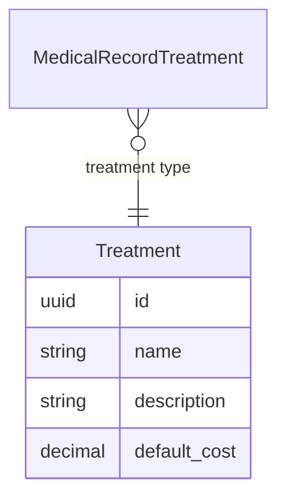

# Treatments API Contract (Flutter)

This document is the API contract for the **Treatments** feature in Hakeem (treatment types / services). It is intended for Flutter developers integrating against the Hakeem backend. It uses the Figma designs as the source of truth for UI and data points and includes examples and a deep dive into the feature. Treatments are used as a lookup in medical record treatment sessions. The API is **implemented** in the backend.

---

## 1. Overview and Authentication

### Base URL

All routes are prefixed with `/api`. Base URL: `https://hakeem.mustafafares.com/api`.

### Authentication

All Treatment endpoints require authentication via **Laravel Sanctum**:

- **Header:** `Authorization: Bearer <token>`
- **Obtain token:** `POST /api/auth/login` with `username` and `password` (or `email` and `password`, depending on backend configuration).

Unauthenticated requests receive **401 Unauthorized**.

### Tenancy

The backend is multi-tenant. The authenticated user’s tenant context is applied automatically; you do **not** send a tenant ID in requests.

### Request and Response Format

- **Content-Type:** `application/json`
- **Request body and query parameters:** **camelCase** (e.g. `name`, `defaultCost`)
- **Response body:** **camelCase** (Laravel API Resources return camelCase keys)

---

## 2. Entity Relationship Diagram



- **Treatment** is a lookup entity. **MedicalRecordTreatment** (1) → (1) **Treatment** (treatment type). See [Medical Record API contract](medical-record-api-contract.md).

---

## 3. Enums (Source of Truth for Dropdowns)

No enums for this feature. Treatment types are free-form (name, description, defaultCost).

---

## 4. Treatments Endpoints

### List Treatments

**`GET /api/treatments`**

Used for: **“Treatment Name” dropdown** in medical record treatment sessions. See [Medical Record API contract](medical-record-api-contract.md) and [Booking API contract](booking-api-contract.md).

**Query parameters:**

| Parameter | Type | Description |
|-----------|------|-------------|
| `perPage` | integer | Page size (1–100). Default: 20 |
| `filter[name]` | string | Partial match on name |
| `filter[description]` | string | Partial match on description |
| `filter[createdAfter]` | date | Created at ≥ |
| `filter[createdBefore]` | date | Created at ≤ |
| `search` | string | Search across name and description |
| `sort` | string | `name`, `-name`, `defaultCost`, `-defaultCost`. Default: `-created_at` |

**Response:** Paginated collection with `data`, `links`, `meta`. Each item follows the Treatment resource shape below.

---

### Create Treatment

**`POST /api/treatments`**

**Request body:**

| Field | Type | Required | Validation |
|-------|------|----------|------------|
| `name` | string | Yes | Max 255 |
| `description` | string | No | Max 1000 |
| `defaultCost` | number | No | Numeric, ≥ 0 |

**Response:** `201 Created`. Full treatment resource in `data` and `message`.

---

### Show Treatment

**`GET /api/treatments/{id}`**

**Response:** `200 OK`. Single treatment resource.

---

### Update Treatment

**`PUT /api/treatments/{id}`** or **`PATCH /api/treatments/{id}`**

**Request body:** Same fields as create, all optional: `name`, `description`, `defaultCost`.

**Response:** `200 OK`. Full treatment resource.

---

### Delete Treatment

**`DELETE /api/treatments/{id}`**

**Response:** `200 OK`. Deleted resource in `data` and `message`.

---

### Treatment Resource Shape (camelCase)

| Field | Type | Description |
|-------|------|-------------|
| `id` | string (UUID) | Primary key |
| `name` | string | Treatment name (e.g. “Initial Cleaning & Cavity Preparation”) |
| `description` | string \| null | Description |
| `defaultCost` | string (decimal) | Default cost |
| `createdAt` | string | ISO date-time |
| `updatedAt` | string | ISO date-time |

---

## 5. Related Endpoints (Figma Dropdowns and Context)

| Purpose | Method | Endpoint | Use in UI |
|---------|--------|----------|-----------|
| Treatment Name dropdown (medical record treatment session) | GET | `/api/treatments` | “Treatment Name” in treatment session; pass selected ID as `treatmentId` when creating/updating a medical record treatment |
| Tooth Details card | GET | `/api/medical-record-treatments/{id}` (with `treatment` loaded) | Display treatment name from relation |
| See Medical Record API | — | [Medical Record API contract](medical-record-api-contract.md) | Treatment sessions and tooth overview |

---

## 6. Deep Dive: Mapping Figma to API

### Screen: Medical Record – Treatment Session “Treatment Name”

| Figma element | API / action |
|----------------|--------------|
| “Treatment Name” dropdown | `GET /api/treatments?perPage=50&sort=name`; pass selected `id` as `treatmentId` in `POST /api/medical-record-treatments` or `PUT /api/medical-record-treatments/{id}` |

---

## 7. Request/Response Examples

### Example: List Treatments (for dropdown)

**Request**

```http
GET /api/treatments?perPage=50&sort=name
Authorization: Bearer <token>
```

**Response (200 OK)** — Paginated list; `data` is an array of treatment resources.

### Example: Create Treatment

**Request**

```http
POST /api/treatments
Content-Type: application/json
Authorization: Bearer <token>
```

```json
{
  "name": "Initial Cleaning & Cavity Preparation",
  "description": "Standard cleaning and cavity prep",
  "defaultCost": 150
}
```

**Response (201 Created)**

```json
{
  "data": {
    "id": "9d4e2c1a-5678-4321-abcd-111111111111",
    "name": "Initial Cleaning & Cavity Preparation",
    "description": "Standard cleaning and cavity prep",
    "defaultCost": "150.00",
    "createdAt": "2025-01-15T10:00:00.000000Z",
    "updatedAt": "2025-01-15T10:00:00.000000Z"
  },
  "message": "Created successfully"
}
```

---

## 8. Error Handling and Validation

| Status | Meaning | Typical cause |
|--------|---------|----------------|
| **401 Unauthorized** | Unauthenticated | Missing or invalid Bearer token |
| **403 Forbidden** | Not allowed | User lacks permission (policy) |
| **404 Not Found** | Resource missing | Invalid UUID or deleted treatment |
| **422 Unprocessable Entity** | Validation failed | Invalid or missing fields (e.g. `name`, `defaultCost`) |

**422 response body** example:

```json
{
  "message": "The given data was invalid.",
  "errors": {
    "name": ["The name field is required."],
    "defaultCost": ["The default cost must be at least 0."]
  }
}
```

**Validation rules (quick reference):**

- **Treatment:** `name` (required, max 255), `description` (optional, max 1000), `defaultCost` (optional, numeric, min 0). Update: same fields optional.

---

## 9. Flutter-Oriented Notes

- **JSON keys:** Use **camelCase** for all request and response keys.
- **IDs:** All resource IDs are **UUID** strings.
- **Pagination:** Use `meta.current_page`, `meta.last_page`, `links.next` / `links.prev`; control page size with `perPage`.
- `defaultCost` is returned as a string (decimal).

---

## 10. Implementation Status

The Treatments API is **implemented** in the backend.
