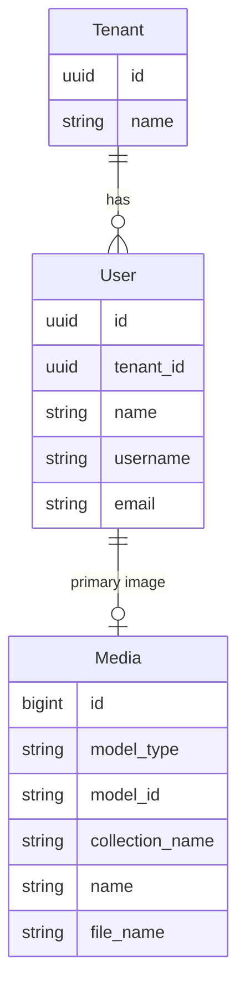

# User Management API Contract (Flutter)

This document is the API contract for the **User Management** feature in Hakeem (doctors, staff). It is intended for Flutter developers integrating against the Hakeem backend. The API is **implemented** in the backend.

---

## 1. Overview and Authentication

### Base URL

All routes are prefixed with `/api`. Base URL: `https://hakeem.mustafafares.com/api`.

### Authentication

All User endpoints require authentication via **Laravel Sanctum**:

- **Header:** `Authorization: Bearer <token>`
- **Obtain token:** `POST /api/auth/login` with `username` and `password` (or `email` and `password`, depending on backend configuration).

Unauthenticated requests receive **401 Unauthorized**.

### Tenancy

The backend is multi-tenant. The authenticated user’s tenant context is applied automatically; you do **not** send a tenant ID in requests.

### Request and Response Format

- **Content-Type:** `application/json` for request body (use `multipart/form-data` when uploading `primaryImage`).
- **Request body and query parameters:** **camelCase**.
- **Response body:** **camelCase** (Laravel API Resources).

---

## 2. Entity Relationship Diagram



- **Tenant** (1) → (N) **User** (users belong to a tenant).
- **User** has one optional **primary image** (profile picture) via Spatie Media Library.

---

## 3. Enums (Source of Truth for Dropdowns)

No domain enums for this feature; **roles** (e.g. doctor, admin) are managed on the backend. Use the role names returned or configured by the backend when creating/updating users via the `roles` array.

---

## 4. Users Endpoints

### List Users

**`GET /api/users`**

Used for: Staff/doctor list, “Select Doctor(s)” in [appointments](booking-api-contract.md) and [medical record treatments](medical-record-api-contract.md).

**Query parameters:**

| Parameter | Type | Description |
|-----------|------|-------------|
| `perPage` | integer | Page size (1–100). Default: 20 |
| `filter[name]` | string | Partial match on name |
| `filter[email]` | string | Partial match on email |
| `filter[createdAfter]` | date | Created at ≥ |
| `filter[createdBefore]` | date | Created at ≤ |
| `search` | string | Search across name and email |
| `sort` | string | `name`, `-name`, `email`, `-email`. Default: `-created_at` |

**Response:** Paginated collection with `data`, `links`, `meta`. Each item follows the User resource shape below.

---

### Create User

**`POST /api/users`**

**Request body (JSON or multipart when including image):**

| Field | Type | Required | Validation |
|-------|------|----------|------------|
| `name` | string | Yes | Max 255 |
| `username` | string | Yes | Min 3, max 191, unique |
| `email` | string | Yes | Email, max 255, unique |
| `password` | string | No | Min 3 (nullable on create) |
| `roles` | array of string | Yes | Role names; each must exist in `roles` |
| `primaryImage` | file | No | Image (jpeg, png, gif, svg, webp), max 2048 KB |

**Response:** `201 Created`. Full user resource with `primaryImage` and `tenant` when loaded.

---

### Show User

**`GET /api/users/{id}`**

**Response:** `200 OK`. Single user resource with `primaryImage`, `tenant` when loaded.

---

### Update User

**`PUT /api/users/{id}`** or **`PATCH /api/users/{id}`**

**Request body:** Same fields as create, all optional: `name`, `username`, `email`, `roles` (nullable array), `primaryImage`. Unique rules for `username` and `email` ignore the current user. No `password` in update request in current backend.

**Response:** `200 OK`. Full user resource.

---

### Delete User

**`DELETE /api/users/{id}`**

**Response:** `200 OK`. Deleted resource in `data` and `message`.

---

### User Resource Shape (camelCase)

| Field | Type | Description |
|-------|------|-------------|
| `id` | string (UUID) | Primary key |
| `name` | string | Full name |
| `email` | string | Email |
| `emailVerifiedAt` | string \| null | ISO date-time when email was verified |
| `primaryImage` | object \| null | Media resource when loaded (id, name, url, etc.) |
| `tenant` | object | Tenant resource when loaded |
| `createdAt` | string | ISO date-time |
| `updatedAt` | string | ISO date-time |

**Note:** The current API resource does not expose `username` or `roles` in the response. Roles are stored for authorization (e.g. doctor, admin). Use `GET /api/users` for listing doctors/staff; filter by role on the backend if such an endpoint or query param is added.

---

## 5. Related Endpoints (Figma Dropdowns and Context)

| Purpose | Method | Endpoint | Use in UI |
|---------|--------|----------|-----------|
| User/staff list | GET | `/api/users` | Staff list, "Select Doctor(s)" in bookings and treatment sessions |
| Single user | GET | `/api/users/{id}` | User profile, edit user |
| Create user | POST | `/api/users` | New User form |
| Update user | PUT/PATCH | `/api/users/{id}` | Edit User |
| Delete user | DELETE | `/api/users/{id}` | Delete user |

- **Booking:** “Select Doctor(s)” when creating/editing appointments — use `GET /api/users` and pass selected IDs as `doctorId` or `doctorIds`. See [Booking API contract](booking-api-contract.md).
- **Medical Record:** “Select Doctor(s)” in treatment sessions — pass selected user IDs as `doctorIds`. See [Medical Record API contract](medical-record-api-contract.md).
- **Profile / Settings:** Show and edit current user; use show/update with the authenticated user’s ID where applicable.

---

## 6. Deep Dive: Mapping Figma to API

### Screen: User List / Staff List

| Figma element | API / action |
|---------------|--------------|
| List of users | `GET /api/users` with optional `search`, `filter[name]`, `filter[email]`, `sort`, `perPage` |
| Search | Use `search` query parameter |
| Click row → open profile | `GET /api/users/{id}` |

### Screen: New User / Edit User Form

| Figma element | API field / action |
|---------------|--------------------|
| Name | `name` |
| Username | `username` |
| Email | `email` |
| Password | `password` (create only; not in update in current backend) |
| Roles dropdown | `roles` — array of role names (e.g. `["doctor"]`) |
| Profile image | `primaryImage` (file upload); use `multipart/form-data` |
| Save | `POST /api/users` (new) or `PUT /api/users/{id}` (edit) |

---

## 7. Request/Response Examples

### List Users (e.g. for doctor dropdown)

**Request**

```http
GET /api/users?perPage=50&sort=name
Authorization: Bearer <token>
```

**Response (200 OK)** — Paginated list; `data` is an array of user resources.

### Create User

**Request**

```http
POST /api/users
Content-Type: application/json
Authorization: Bearer <token>
```

```json
{
  "name": "Dr. Adam Den",
  "username": "adam.den",
  "email": "adam.den@example.com",
  "password": "secret123",
  "roles": ["doctor"]
}
```

**Response (201 Created)** — `data` contains full user resource; `message` in body.

---

## 8. Error Handling and Validation

| Status | Meaning | Typical cause |
|--------|---------|----------------|
| **401 Unauthorized** | Unauthenticated | Missing or invalid Bearer token |
| **403 Forbidden** | Not allowed | User lacks permission (policy) |
| **404 Not Found** | Resource missing | Invalid UUID or deleted user |
| **422 Unprocessable Entity** | Validation failed | Invalid or missing fields; duplicate username/email; invalid roles |

**422 response body** example:

```json
{
  "message": "The given data was invalid.",
  "errors": {
    "username": ["The username has already been taken."],
    "email": ["The email has already been taken."],
    "roles.0": ["The selected roles.0 is invalid."]
  }
}
```

**Validation rules (quick reference):**

- **Create:** `name` (required, max 255), `username` (required, 3–191 chars, unique), `email` (required, email, max 255, unique), `password` (optional, min 3), `roles` (required array, role names must exist in `roles`), `primaryImage` (optional file, image types, max 2048 KB).
- **Update:** Same fields optional; unique rules for `username` and `email` ignore the current user. No `password` in update in current backend.

---

## 9. Flutter-Oriented Notes

- **JSON keys:** Use **camelCase** for all request and response keys.
- **Upload:** Use **multipart/form-data** when sending `primaryImage`; other fields as form fields or JSON.
- **IDs:** All resource IDs are **UUID** strings.
- **Pagination:** Use `meta.current_page`, `meta.last_page`, `links.next` / `links.prev`; control page size with `perPage`.

---

## 10. Implementation Status

The User Management API is **implemented** in the backend.
